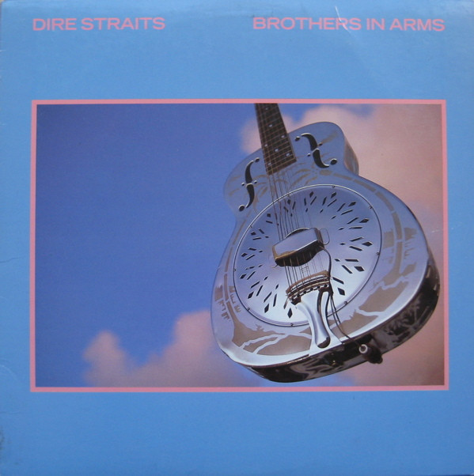

# Brothers In Arms

By Dire Straits

## Album Data

[Discogs URL](https://www.discogs.com/release/770027-Dire-Straits-Brothers-In-Arms)

- Catalog #: 1-25264, 9 25264-1
- Label: Warner Bros. Records, Warner Bros. Records
- Format: LP, Album, Spe
- Rating: 
- Released: 1985
- Release ID: 770027
- Media condition: Good Plus (G+)
- Sleeve condition: Very Good (VG)
- Speed: 33 rpm
- Weight: 

## See also

- [ExtendeDancEPlay](ExtendeDancEPlay.md)
- [Love Over Gold](Love_Over_Gold.md)
- [Making Movies](Making_Movies.md)
- [Money For Nothing](Money_For_Nothing.md)
