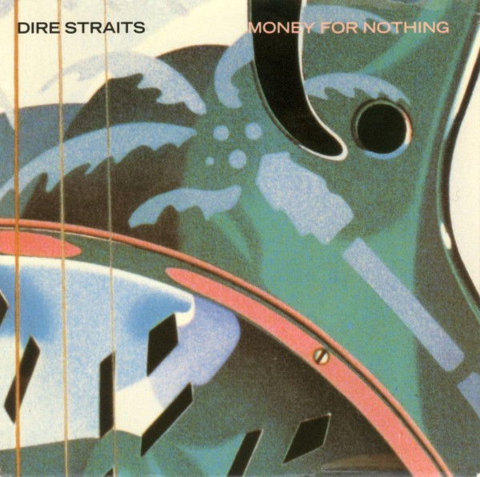

# Money For Nothing

By Dire Straits

## Album Data

[Discogs URL](https://www.discogs.com/release/860323-Dire-Straits-Money-For-Nothing)

- Catalog #: 7-28950, 9 28950-7
- Label: Warner Bros. Records, Warner Bros. Records
- Format: 7", Single, Spe
- Rating: 
- Released: 1985
- Release ID: 860323
- Media condition: Very Good Plus (VG+)
- Sleeve condition: Very Good Plus (VG+)
- Speed: 45 rpm
- Weight: 

## See also

- [Brothers In Arms](Brothers_In_Arms.md)
- [ExtendeDancEPlay](ExtendeDancEPlay.md)
- [Love Over Gold](Love_Over_Gold.md)
- [Making Movies](Making_Movies.md)
