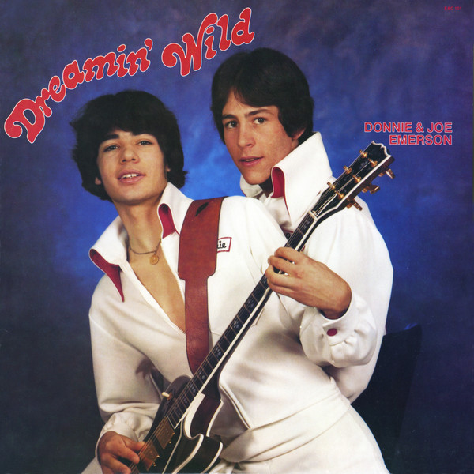

# Dreamin' Wild

By Donnie & Joe Emerson

## Album Data

[Discogs URL](https://www.discogs.com/release/3669424-Donnie-&-Joe-Emerson-Dreamin'-Wild)

- Catalog #: LITA 082
- Label: Light In The Attic
- Formats: Vinyl
- Format: LP, Album, RE, RM, Reissue, Remastered
- Rating: 
- Released: 2012
- Year: 1979
- Release ID: 3669424
- Media condition: Mint (M)
- Sleeve condition: Mint (M)
- Speed: 33 rpm
- Weight: 180 gram

## Album Tracks

| **Position** | **Title** | **Duration** |
|--------------|-----------|--------------|
| A1 | **Good Time** | 4:20 |
| A2 | **Give Me The Chance** | 2:50 |
| A3 | **Baby** | 4:00 |
| A4 | **Feels Like The Sun** | 6:30 |
| B1 | **Love Is** | 3:00 |
| B2 | **Don't Go Lovin' Nobody Else** | 5:30 |
| B3 | **Dream Full Of Dreams** | 5:00 |
| B4 | **My Heart** | 7:04 |

## Artist Roles

| **Name** | **Role** |
|----------|----------|
| **Strath Shepard** | Design [Re-release] |
| **Dave Segal (2)** | Liner Notes |
| **Matt Sullivan (4)** | Producer [Re-release] |
| **Donnie Emerson** | Producer, Mixed By, Engineer |
| **Dave Cooley** | Remastered By |
| **Donnie & Joe Emerson** | Written-By |
| **Donnie Emerson** | Written-By |

## See also

- [Still Dreamin' Wild](Still_Dreamin_Wild-_The_Lost_Recordings_1979-81.md)
- [Beets: Dreamin' Wild](../../Beets/Donnie_and_Joe_Emerson/Dreamin_Wild.md)
- [Beets: Still Dreamin' Wild](../../Beets/Donnie_and_Joe_Emerson/Still_Dreamin_Wild.md)
