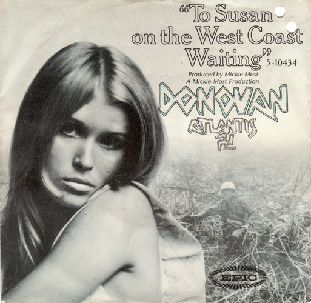

# To Susan On The West Coast Waiting / Atlantis

By Donovan

## Album Data

[Discogs URL](https://www.discogs.com/release/469690-Donovan-To-Susan-On-The-West-Coast-Waiting-/-Atlantis)

- Catalog #: 5-10434
- Label: Epic
- Formats: Vinyl, Terre Haute
- Format: 7", Single, Mono, Styrene, Ter
- Rating: 
- Released: 1969
- Year: 1969
- Release ID: 469690
- Media condition: Very Good Plus (VG+)
- Sleeve condition: 
- Speed: 45 rpm
- Weight: 

## Album Tracks

| **Position** | **Title** | **Duration** |
|--------------|-----------|--------------|
| A | **To Susan On The West Coast Waiting** | 3:13 |
| B | **Atlantis** | 4:58 |

## Artist Roles

| **Name** | **Role** |
|----------|----------|
| **Mickie Most** | Producer |
| **Donovan Phillips Leitch** | Written-By |

## See also

- [A Gift From A Flower To A Garden](A_Gift_From_A_Flower_To_A_Garden.md)
- [Cosmic Wheels](Cosmic_Wheels.md)
- [Sunshine Superman](Sunshine_Superman.md)
- [Beets: a gift from a flower to a garden](../../Beets/Donovan/a_gift_from_a_flower_to_a_garden.md)
- [Beets: A Golden Hour of Donovan](../../Beets/Donovan/A_Golden_Hour_of_Donovan.md)
- [Beets: Donovan's Greatest Hits](../../Beets/Donovan/Donovans_Greatest_Hits.md)
- [Beets: Sunshine Superman](../../Beets/Donovan/Sunshine_Superman.md)
- [Beets: Super Hits](../../Beets/Donovan/Super_Hits.md)
- [Beets: Try For The Sun](../../Beets/Donovan/Try_For_The_Sun_2_3.md)
- [Beets: Try For The Sun](../../Beets/Donovan/Try_For_The_Sun_2.md)
- [Beets: Try For The Sun](../../Beets/Donovan/Try_For_The_Sun.md)
- [CD: ](../../CD/Donovan/Donovan.md)
- [CD: Try For The Sun](../../CD/Donovan/Try_For_The_Sun-_The_Journey_Of_Donovan_Disc_1.md)
- [CD: Try For The Sun](../../CD/Donovan/Try_For_The_Sun-_The_Journey_Of_Donovan_Disc_2.md)
- [CD: Try For The Sun](../../CD/Donovan/Try_For_The_Sun-_The_Journey_Of_Donovan_Disc_3.md)
- [Roon: A Gift From A Flower To A Garden](../../Roon/Donovan/A_Gift_From_A_Flower_To_A_Garden.md)
- [Roon: Barabajagal](../../Roon/Donovan/Barabajagal.md)
- [Roon: Catch the Wind](../../Roon/Donovan/Catch_the_Wind.md)
- [Roon: Donovan's Greatest Hits](../../Roon/Donovan/Donovans_Greatest_Hits.md)
- [Roon: Fairytale (Deluxe Expanded Edition)](../../Roon/Donovan/Fairytale_Deluxe_Expanded_Edition.md)
- [Roon: Fairytales and Colours](../../Roon/Donovan/Fairytales_and_Colours.md)
- [Roon: Mellow Yellow](../../Roon/Donovan/Mellow_Yellow.md)
- [Roon: Open Road](../../Roon/Donovan/Open_Road.md)
- [Roon: Sunshine Superman](../../Roon/Donovan/Sunshine_Superman.md)
- [Roon: The Hurdy Gurdy Man](../../Roon/Donovan/The_Hurdy_Gurdy_Man.md)
