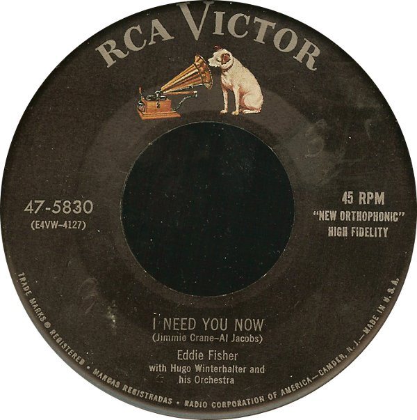

# I Need You Now / Heaven Was Never Like This

By Eddie Fisher

## Album Data

[Discogs URL](https://www.discogs.com/release/3065717-Eddie-Fisher-I-Need-You-Now-/-Heaven-Was-Never-Like-This)

- Catalog #: 47-5830
- Label: RCA Victor
- Format: 7", Single, Ind
- Rating: 
- Released: 1954
- Release ID: 3065717
- Media condition: Near Mint (NM or M-)
- Sleeve condition: 
- Speed: 45 rpm
- Weight: 

## Album Tracks

| **Position** | **Title** | **Duration** |
|--------------|-----------|--------------|
| A | **I Need You Now** |  |
| B | **Heaven Was Never Like This** |  |

## See also

- 
- [Beets: All-Time Greatest Hits](../../Beets/Eddie_Fisher/All-Time_Greatest_Hits.md)
- [Beets: All Time Greatest Hits](../../Beets/Eddie_Fisher/All_Time_Greatest_Hits.md)
- [Beets: Back To The Fifties Disk 2](../../Beets/Eddie_Fisher/Back_To_The_Fifties_Disk_2.md)
- [Beets: Unknown Album](../../Beets/Eddie_Fisher/Unknown_Album.md)
