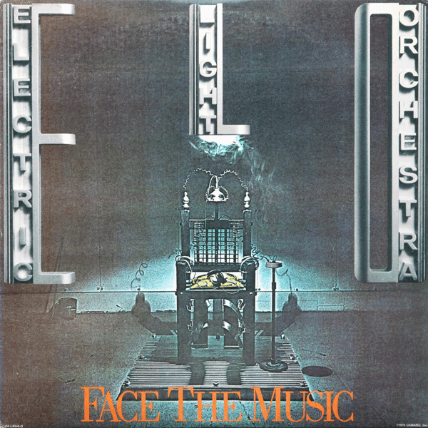

# Face The Music

By Electric Light Orchestra

## Album Data

[Discogs URL](https://www.discogs.com/release/5607994-Electric-Light-Orchestra-Face-The-Music)

- Catalog #: UA-LA546-G
- Label: United Artists Records, Jet Records
- Format: LP, Album, RCA
- Rating: 
- Released: 1975
- Release ID: 5607994
- Media condition: Very Good Plus (VG+)
- Sleeve condition: Good Plus (G+)
- Speed: 33 rpm
- Weight: 

## See also

- [Eldorado - A Symphony By The Electric Light Orchestra](Eldorado_-_A_Symphony_By_The_Electric_Light_Orchestra.md)
