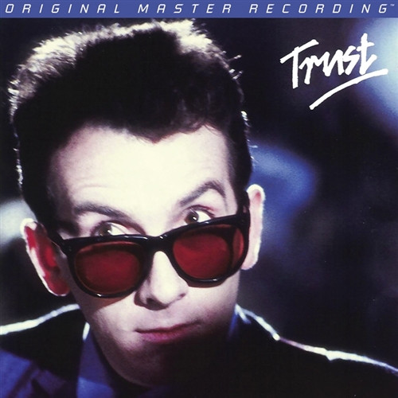

# Trust

By Elvis Costello & The Attractions

## Album Data

[Discogs URL](https://www.discogs.com/release/7543415-Elvis-Costello-&-The-Attractions-Trust)

- Catalog #: MFSL 1-340
- Label: Mobile Fidelity Sound Lab
- Formats: Vinyl
- Format: LP, Album, Ltd, Num, RE, RM
- Rating: 
- Released: 2015
- Year: 1981
- Release ID: 7543415
- Media condition: Mint (M)
- Sleeve condition: Mint (M)
- Speed: 33 rpm
- Weight: 180 gram

## Album Tracks

| **Position** | **Title** | **Duration** |
|--------------|-----------|--------------|
| A1 | **Clubland** | 3:41 |
| A2 | **Lovers Walk** | 2:16 |
| A3 | **You'll Never Be A Man** | 2:56 |
| A4 | **Pretty Words** | 3:10 |
| A5 | **Strict Time** | 2:40 |
| A6 | **Luxembourg** | 2:27 |
| A7 | **Watch Your Step** | 2:59 |
| B1 | **New Lace Sleeves** | 3:45 |
| B2 | **From A Whisper To A Scream** | 2:53 |
| B3 | **Different Finger** | 1:58 |
| B4 | **White Knuckles** | 3:47 |
| B5 | **Shot With His Own Gun** | 3:29 |
| B6 | **Fish 'N' Chip Paper** | 2:55 |
| B7 | **Big Sister's Clothes** | 2:12 |

## Artist Roles

| **Name** | **Role** |
|----------|----------|
| **Krieg Wunderlich** | Lacquer Cut By |
| **Krieg Wunderlich** | Mastered By |
| **Nick Lowe** | Producer |
| **Neill King** | Producer [Assisted By] |
| **Roger Bechirian** | Producer [In Association With] |
| **Elvis Costello** | Written-By |

## See also

- [Accidents Will Happen / Alison](Accidents_Will_Happen_-_Alison.md)
- [Beets: 50,000,000 Elvis Fans Can’t Be Wrong](../../Beets/Elvis_Costello_and_The_Attractions/50_000_000_Elvis_Fans_Can’t_Be_Wrong.md)
- [Beets: Blood & Chocolate](../../Beets/Elvis_Costello_and_The_Attractions/Blood_and_Chocolate.md)
- [Beets: Momofuku](../../Beets/Elvis_Costello_and_The_Attractions/Momofuku.md)
- [Roon: Armed Forces (Remastered 2020)](../../Roon/Elvis_Costello_and_The_Attractions/Armed_Forces_Remastered_2020.md)
- [Roon: Blood And Chocolate](../../Roon/Elvis_Costello_and_The_Attractions/Blood_And_Chocolate.md)
- [Roon: Imperial Bedroom](../../Roon/Elvis_Costello_and_The_Attractions/Imperial_Bedroom.md)
- [Roon: Spanish Model](../../Roon/Elvis_Costello_and_The_Attractions/Spanish_Model.md)
- [Roon: This Year's Model](../../Roon/Elvis_Costello_and_The_Attractions/This_Years_Model.md)
- [Roon: Trust](../../Roon/Elvis_Costello_and_The_Attractions/Trust.md)
