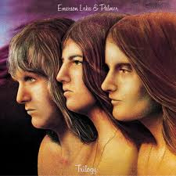

# Trilogy

By "Emerson, Lake & Palmer"

## Album Data

[Discogs URL](https://www.discogs.com/release/9193754-"Emerson,-Lake-&-Palmer"-Trilogy)

- Catalog #: BMGCATLP5
- Label: BMG, Manticore
- Format: LP, Album, RE, RM, Gat
- Rating: 
- Released: 2016
- Release ID: 9193754
- Media condition: Mint (M)
- Sleeve condition: Mint (M)
- Speed: 33 rpm
- Weight: 180 gram

## See also

- [Brain Salad Surgery](Brain_Salad_Surgery.md)
- ["Emerson, Lake & Palmer"](Emerson__Lake_and_Palmer.md)
