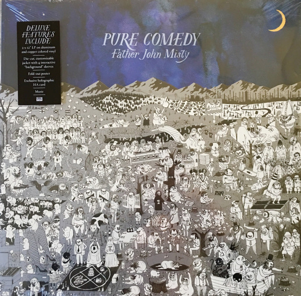

# Pure Comedy

By Father John Misty

## Album Data

[Discogs URL](https://www.discogs.com/release/10059497-Father-John-Misty-Pure-Comedy)

- Catalog #: SP1200
- Label: Sub Pop
- Format: LP, Alu + LP, Cop + Album, Dlx
- Rating: 
- Released: 2017
- Release ID: 10059497
- Media condition: Mint (M)
- Sleeve condition: Mint (M)
- Speed: 33 rpm
- Weight: 

## Album Tracks

| **Position** | **Title** | **Duration** |
|--------------|-----------|--------------|
| A1 | **Pure Comedy** |  |
| A2 | **Total Entertainment Forever** |  |
| A3 | **Things It Would Have Been Helpful To Know Before The Revolution** |  |
| A4 | **Ballad Of The Dying Man** |  |
| B1 | **Birdie** |  |
| B2 | **Leaving LA** |  |
| C1 | **A Bigger Paper Bag** |  |
| C2 | **When The God Of Love Returns There'll Be Hell To Pay** |  |
| C3 | **Smoochie** |  |
| C4 | **Two Wildly Different Perspectives** |  |
| C5 | **The Memo** |  |
| D1 | **So I'm Growing Old On Magic Mountain** |  |
| D2 | **In Twenty Years Or So** |  |

## Artist Roles

| **Name** | **Role** |
|----------|----------|
| **Chris Bellman** | Lacquer Cut By |
| **J. Tillman** | Written-By |

## See also

- [Fear Fun](Fear_Fun.md)
- ["I Love You, Honeybear"](I_Love_You__Honeybear.md)
- [Beets: Anthem +3](../../Beets/Father_John_Misty/Anthem_+3.md)
- [Beets: Fear Fun](../../Beets/Father_John_Misty/Fear_Fun.md)
- [Beets: God’s Favorite Customer](../../Beets/Father_John_Misty/God’s_Favorite_Customer.md)
- [Beets: I Love You, Honeybear](../../Beets/Father_John_Misty/I_Love_You__Honeybear.md)
- [Beets: Off-Key In Hamburg](../../Beets/Father_John_Misty/Off-Key_In_Hamburg.md)
- [Beets: Pure Comedy](../../Beets/Father_John_Misty/Pure_Comedy.md)
- [CD: ](../../CD/Father_John_Misty/Father_John_Misty.md)
- [CD: Fear Fun](../../CD/Father_John_Misty/Fear_Fun.md)
- [Roon: Anthem +3](../../Roon/Father_John_Misty/Anthem_+3.md)
- [Roon: Chateau Lobby #4 (in C for Two Virgins)](../../Roon/Father_John_Misty/Chateau_Lobby_4_in_C_for_Two_Virgins.md)
- [Roon: Chloë and the Next 20th Century](../../Roon/Father_John_Misty/Chloë_and_the_Next_20th_Century.md)
- [Roon: Fear Fun](../../Roon/Father_John_Misty/Fear_Fun.md)
- [Roon: God's Favorite Customer](../../Roon/Father_John_Misty/Gods_Favorite_Customer.md)
- [Roon: I Love You, Honeybear](../../Roon/Father_John_Misty/I_Love_You__Honeybear.md)
- [Roon: Off-Key in Hamburg](../../Roon/Father_John_Misty/Off-Key_in_Hamburg.md)
- [Roon: Pure Comedy](../../Roon/Father_John_Misty/Pure_Comedy.md)
- [Roon: Things It Would Have Been Helpful to Know Before the Revolution (The Haxan Cloak Remix)](../../Roon/Father_John_Misty/Things_It_Would_Have_Been_Helpful_to_Know_Before_the_Revolution_The_Haxan_Cloak_Remix.md)
