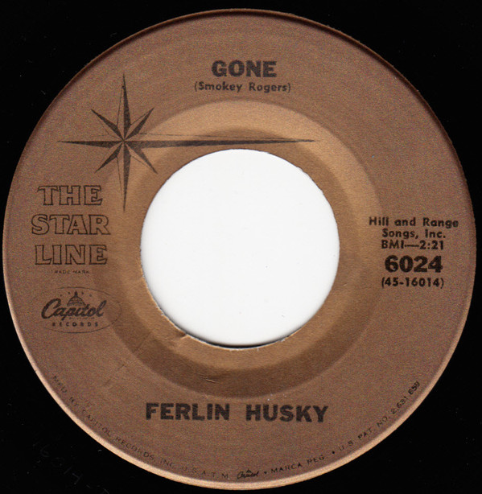

# Gone / Wings Of A Dove

By Ferlin Husky

## Album Data

[Discogs URL](https://www.discogs.com/release/7732291-Ferlin-Husky-Gone-/-Wings-Of-A-Dove)

- Catalog #: 6024
- Label: Capitol Records
- Formats: Vinyl
- Format: 7", RE, 45 RPM, Reissue
- Rating: 
- Released: 1960
- Year: 1964
- Release ID: 7732291
- Media condition: Very Good Plus (VG+)
- Sleeve condition: 
- Speed: 45 rpm
- Weight: 

## Album Tracks

| **Position** | **Title** | **Duration** |
|--------------|-----------|--------------|
| A | **Gone** | 2:21 |
| B | **Wings Of A Dove** | 2:18 |

## See also

- 
