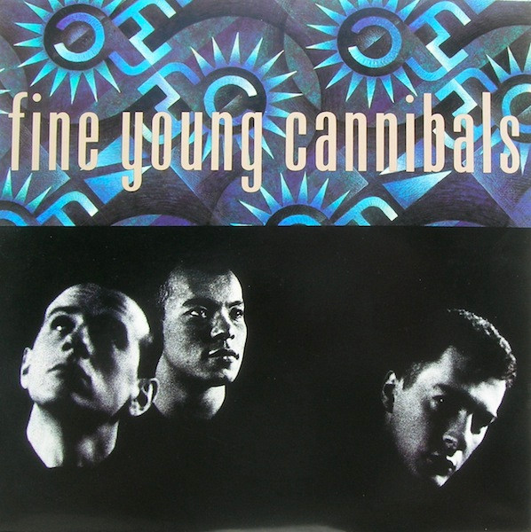

# Fine Young Cannibals

By Fine Young Cannibals

## Album Data

[Discogs URL](https://www.discogs.com/release/181669-Fine-Young-Cannibals-Fine-Young-Cannibals)

- Catalog #: IRS-5683
- Label: I.R.S. Records
- Formats: Vinyl, Pinckneyville, Pressing
- Format: LP, Album, Pin
- Rating: 
- Released: 1985
- Year: 1985
- Release ID: 181669
- Media condition: Very Good (VG)
- Sleeve condition: Very Good (VG)
- Speed: 33 rpm
- Weight: 

## Album Tracks

| **Position** | **Title** | **Duration** |
|--------------|-----------|--------------|
| A1 | **Johnny Come Home** | 3:35 |
| A2 | **Couldn't Care More** | 3:30 |
| A3 | **Don't Ask Me To Choose** | 3:05 |
| A4 | **Funny How Love Is** | 3:28 |
| A5 | **Suspicious Minds** | 3:56 |
| B1 | **Blue** | 3:35 |
| B2 | **Move To Work** | 3:26 |
| B3 | **On A Promise** | 3:06 |
| B4 | **Time Isn't Kind** | 3:12 |
| B5 | **Like A Stranger** | 3:28 |

## Artist Roles

| **Name** | **Role** |
|----------|----------|
| **David Steele** | Bass, Piano, Keyboards |
| **Design KB** | Cover [Cover Art], Design |
| **Martin Parry** | Drums |
| **Alvin Clark** | Engineer |
| **Alvin Clark** | Engineer [Additional Engineer] |
| **Phil Savage** | Engineer [Additional Engineer] |
| **Dave Anderson** | Engineer [Assistant Engineer] |
| **Tim Young** | Engineer [Cutting Engineer] |
| **Mike Pela** | Engineer [Production Engineer] |
| **John Hudson** | Engineer [Recording Engineer] |
| **Andy Cox** | Guitar |
| **AGM Management** | Management |
| **Tony Meilandt** | Management |
| **Mike Pela** | Mixed By |
| **Robin Millar** | Mixed By |
| **Dennis Weinreich** | Mixed By [Mixing Engineer] |
| **Andy Cox** | Performer [Fine Young Cannibals] |
| **David Steele** | Performer [Fine Young Cannibals] |
| **Roland Gift** | Performer [Fine Young Cannibals] |
| **Paul Slattery** | Photography By [Back Cover] |
| **Anton Corbijn** | Photography By [Front Cover] |
| **Andy Cox** | Producer |
| **Bob Sargeant** | Producer |
| **David Steele** | Producer |
| **Mike Pela** | Producer |
| **Robin Millar** | Producer |
| **Roland Gift** | Producer |
| **Graeme Hamilton** | Trumpet |
| **Gavyn Wright** | Violin |
| **Roland Gift** | Vocals [Singing] |
| **Andy Cox** | Written-By |
| **David Steele** | Written-By |
| **Mark James (4)** | Written-By |
| **Roland Gift** | Written-By |

## See also

- 
