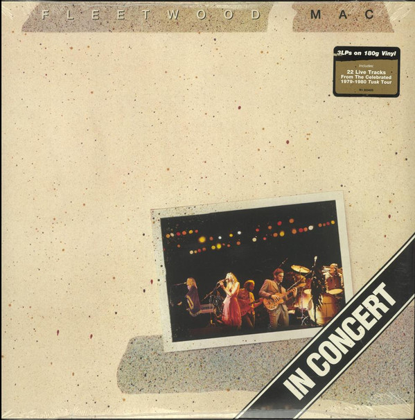

# In Concert

By Fleetwood Mac

## Album Data

[Discogs URL](https://www.discogs.com/release/8205362-Fleetwood-Mac-In-Concert)

- Catalog #: R1 553403
- Label: Warner Bros. Records
- Format: 3xLP, Album, 180
- Rating: 
- Released: 2016
- Release ID: 8205362
- Media condition: Mint (M)
- Sleeve condition: Mint (M)
- Speed: 33 rpm
- Weight: 180 gram

## See also

- [Don't Stop / Never Going Back Again](Dont_Stop_-_Never_Going_Back_Again.md)
- [Jumping At Shadows](Jumping_At_Shadows.md)
- [Rumours](Rumours.md)
- [Beets: Fillmore West 1.4.70](../../Beets/Fleetwood_Mac/Fillmore_West_1470.md)
- [Beets: Fleetwood Mac - Live](../../Beets/Fleetwood_Mac/Fleetwood_Mac_-_Live.md)
- [Beets: Fleetwood Mac](../../Beets/Fleetwood_Mac/Fleetwood_Mac.md)
- [Beets: Live at the Boston Tea Party, Part One](../../Beets/Fleetwood_Mac/Live_at_the_Boston_Tea_Party__Part_One.md)
- [Beets: Live at the Boston Tea Party, Part Two](../../Beets/Fleetwood_Mac/Live_at_the_Boston_Tea_Party__Part_Two.md)
- [Beets: Live At The Boston Tea Party, Pt. 3](../../Beets/Fleetwood_Mac/Live_At_The_Boston_Tea_Party__Pt_3.md)
- [Beets: Live at The Marquee](../../Beets/Fleetwood_Mac/Live_at_The_Marquee.md)
- [Beets: Madison Blues [Disc 2]](../../Beets/Fleetwood_Mac/Madison_Blues_[Disc_2].md)
- [Beets: Madison Blues Live](../../Beets/Fleetwood_Mac/Madison_Blues_Live.md)
- [Beets: Mystery to Me](../../Beets/Fleetwood_Mac/Mystery_to_Me.md)
- [Beets: Rumours](../../Beets/Fleetwood_Mac/Rumours.md)
- [Beets: Shrine ’69](../../Beets/Fleetwood_Mac/Shrine_’69.md)
- [Beets: The Best Of Peter Green`s Fleetwood Mac](../../Beets/Fleetwood_Mac/The_Best_Of_Peter_Green`s_Fleetwood_Mac.md)
- [CD: ](../../CD/Fleetwood_Mac/Fleetwood_Mac.md)
- [CD: Mystery To Me](../../CD/Fleetwood_Mac/Mystery_To_Me.md)
- [Roon: Bare Trees](../../Roon/Fleetwood_Mac/Bare_Trees.md)
- [Roon: Fleetwood Mac](../../Roon/Fleetwood_Mac/Fleetwood_Mac.md)
- [Roon: Mystery to Me](../../Roon/Fleetwood_Mac/Mystery_to_Me.md)
- [Roon: Rumours (2001 Remaster)](../../Roon/Fleetwood_Mac/Rumours_2001_Remaster.md)
- [Roon: The Dance (Live at Warner Brothers Studios in Burbank, CA 5/23/97)](../../Roon/Fleetwood_Mac/The_Dance_Live_at_Warner_Brothers_Studios_in_Burbank__CA_5-23-97.md)
- [Roon: Then Play On (2013 Remaster; Expanded Edition)](../../Roon/Fleetwood_Mac/Then_Play_On_2013_Remaster;_Expanded_Edition.md)
- [Roon: Tusk (2015 Remaster)](../../Roon/Fleetwood_Mac/Tusk_2015_Remaster.md)
