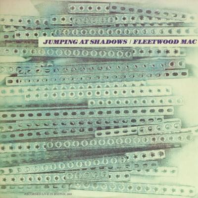

# Jumping At Shadows

By Fleetwood Mac

## Album Data

[Discogs URL](https://www.discogs.com/release/2278515-Fleetwood-Mac-Jumping-At-Shadows)

- Catalog #: VR020
- Label: Varrick Records
- Format: LP, Album
- Rating: 
- Released: 1985
- Release ID: 2278515
- Media condition: Very Good Plus (VG+)
- Sleeve condition: Near Mint (NM or M-)
- Speed: 33 rpm
- Weight: 

## See also

- [Don't Stop / Never Going Back Again](Dont_Stop_-_Never_Going_Back_Again.md)
- [In Concert](In_Concert.md)
- [Rumours](Rumours.md)
