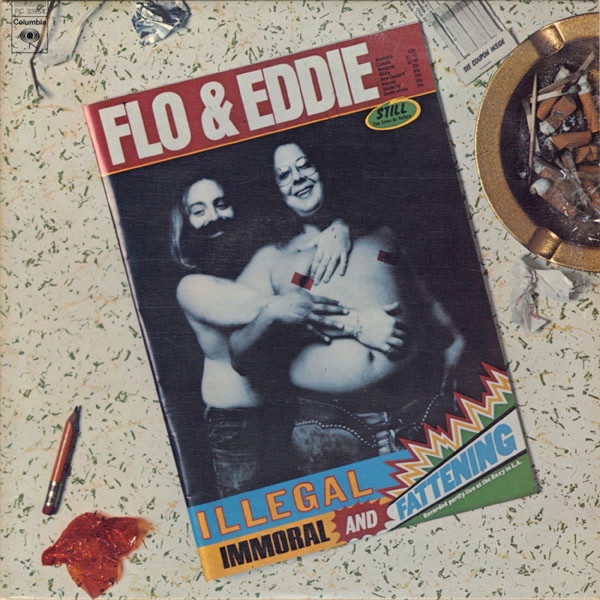

# "Illegal, Immoral And Fattening"

By Flo & Eddie

## Album Data

[Discogs URL](https://www.discogs.com/release/1219175-Flo-&-Eddie-"Illegal,-Immoral-And-Fattening")

- Catalog #: PC 33554
- Label: Columbia
- Formats: Vinyl, Santa Maria Pressing
- Format: LP, Album, San
- Rating: 
- Released: 1975
- Year: 1975
- Release ID: 1219175
- Media condition: Good Plus (G+)
- Sleeve condition: Very Good (VG)
- Speed: 33 rpm
- Weight: 

## Album Tracks

| **Position** | **Title** | **Duration** |
|--------------|-----------|--------------|
| A1 | **Illegal, Immoral And Fattening** | 3:11 |
| A2 | **Rebecca** | 2:41 |
| A3 | **Kama Sutra Time** | 6:40 |
| A4 | **The Sanzini Brothers Return (With The Tibetan Memory Trick)** | 2:50 |
| A5 | **Livin' In The Jungle** | 3:40 |
| B1 | **Cheap** | 2:40 |
|  | **Live Medley** | 10:17 |
| B5 | **Let Me Make Love To You** | 2:20 |
| B6 | **There's No Business Like Show Business** | 3:40 |

## Artist Roles

| **Name** | **Role** |
|----------|----------|
| **Nick DeCaro** | Arranged By, Conductor |
| **Ron Coro** | Art Direction |
| **Alan Harnetaux** | Crew [Technical Crew] |
| **Bob Truax** | Crew [Technical Crew] |
| **George Thrift** | Crew [Technical Crew] |
| **Bill Naegels** | Design Concept |
| **Rod Dyer, Inc.** | Design Concept |
| **Alex Kazanegras** | Engineer |
| **Dee Robb** | Engineer |
| **Tom Perry** | Engineer [Mixing] |
| **Skip Taylor Productions, Inc.** | Management, Directed By |
| **Doug Sax** | Mastered By [Disc Mastering] |
| **Erik Scott** | Musician [The Players], Bass |
| **Leland Sklar** | Musician [The Players], Bass |
| **Aynsley Dunbar** | Musician [The Players], Drums |
| **Craig Krampf** | Musician [The Players], Drums |
| **Danny Kortchmar** | Musician [The Players], Guitar |
| **Andy Cahan** | Musician [The Players], Keyboards |
| **Ian Underwood** | Musician [The Players], Keyboards |
| **Phil Reed (6)** | Musician [The Players], Lead Guitar |
| **Howard Kaylan** | Musician [The Players], Lead Vocals |
| **Mark Volman** | Musician [The Players], Vocals, Guitar |
| **Mark Volman And Howard Kaylan** | Performer [Flo And Eddie Are] |
| **Chuck Pulin** | Photography By [Inner Sleeve Photo] |
| **Alky Georgiades** | Photography By [Jacket Photos] |
| **Norman Seeff** | Photography By [Magazine Photos] |
| **Joe Wissert** | Producer |

## See also

- [Moving Targets](Moving_Targets.md)
- [Beets: Flo & Eddie](../../Beets/Flo_and_Eddie/Flo_and_Eddie.md)
- [Beets: Illegal, Immoral and Fattening](../../Beets/Flo_and_Eddie/Illegal__Immoral_and_Fattening.md)
- [Beets: Moving Targets](../../Beets/Flo_and_Eddie/Moving_Targets.md)
- [Beets: The Phlorescent Leech & Eddie](../../Beets/Flo_and_Eddie/The_Phlorescent_Leech_and_Eddie.md)
- [Roon: Illegal, Immoral and Fattening](../../Roon/Flo_and_Eddie/Illegal__Immoral_and_Fattening.md)
- [Roon: Moving Targets](../../Roon/Flo_and_Eddie/Moving_Targets.md)
