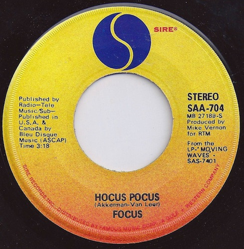

# Hocus Pocus

By Focus

## Album Data

[Discogs URL](https://www.discogs.com/release/1716655-Focus-(2)-Hocus-Pocus)

- Catalog #: SAA-704
- Label: Sire
- Format: 7", Single
- Rating: 
- Released: 1973
- Release ID: 1716655
- Media condition: Very Good (VG)
- Sleeve condition: 
- Speed: 45 rpm
- Weight: 

## See also

- 
- [Roon: Focus 3 (2020 Remastered Edition)](../../Roon/Focus/Focus_3_2020_Remastered_Edition.md)
- [Roon: Hamburger Concerto (2020 Remastered Edition)](../../Roon/Focus/Hamburger_Concerto_2020_Remastered_Edition.md)
- [Roon: Moving Waves](../../Roon/Focus/Moving_Waves.md)
