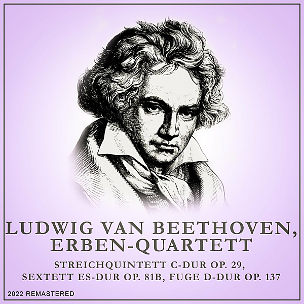

# Streichquintett C-Dur

By "Franz Schubert, Emerson String Quartet, Mstislav Rostropovich"

## Album Data

[Discogs URL](https://www.discogs.com/release/6671776-"Franz-Schubert,-Emerson-String-Quartet,-Mstislav-Rostropovich"-Streichquintett-C-Dur)

- Catalog #: 00289 479 4384
- Label: Deutsche Grammophon
- Format: LP, Album, RE, 180
- Rating: 
- Released: 2015
- Release ID: 6671776
- Media condition: Mint (M)
- Sleeve condition: Mint (M)
- Speed: 33 rpm
- Weight: 180 gram

