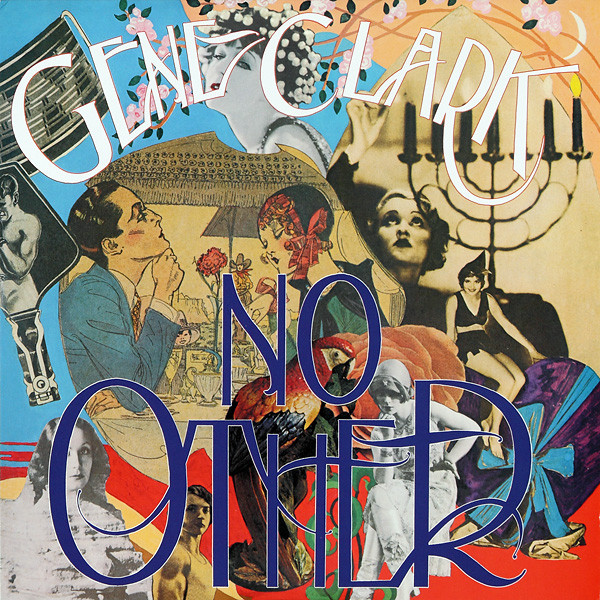

# No Other

By Gene Clark

## Album Data

[Discogs URL](https://www.discogs.com/release/3601360-Gene-Clark-No-Other)

- Catalog #: 4M200
- Label: 4 Men With Beards
- Formats: Vinyl
- Format: LP, Album, RE
- Rating: 
- Released: 2012
- Year: 1974
- Release ID: 3601360
- Media condition: Mint (M)
- Sleeve condition: Mint (M)
- Speed: 33 rpm
- Weight: 180 gram

## Album Tracks

| **Position** | **Title** | **Duration** |
|--------------|-----------|--------------|
| A1 | **Life's Greatest Fool** | 4:44 |
| A2 | **Silver Raven** | 4:53 |
| A3 | **No Other** | 5:08 |
| A4 | **Strength Of Strings** | 6:30 |
| B1 | **From A Silver Phial** | 3:40 |
| B2 | **Some Misunderstanding** | 8:10 |
| B3 | **The True One** | 4:57 |
| B4 | **Lady Of The North** | 6:04 |

## See also

- [Two Sides To Every Story](Two_Sides_To_Every_Story.md)
- [Beets: No Other](../../Beets/Gene_Clark/No_Other.md)
- [Beets: Two Sides To Every Story](../../Beets/Gene_Clark/Two_Sides_To_Every_Story.md)
- [Roon: No Other (Deluxe Edition)](../../Roon/Gene_Clark/No_Other_Deluxe_Edition.md)
- [Roon: White Light](../../Roon/Gene_Clark/White_Light.md)
