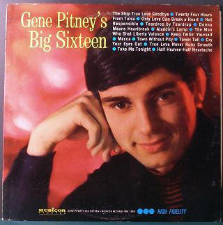

# Gene Pitney's Big Sixteen

By Gene Pitney

## Album Data

[Discogs URL](https://www.discogs.com/release/1573022-Gene-Pitney-Gene-Pitney's-Big-Sixteen)

- Catalog #: MM 2008
- Label: Musicor Records
- Format: LP, Comp, Mono, Pit
- Rating: 
- Released: 1964
- Release ID: 1573022
- Media condition: Very Good Plus (VG+)
- Sleeve condition: Very Good Plus (VG+)
- Speed: 33 rpm
- Weight: 

