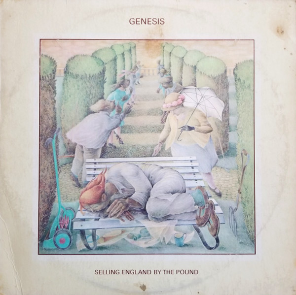

# Selling England By The Pound

By Genesis

## Album Data

[Discogs URL](https://www.discogs.com/release/4789008-Genesis-Selling-England-By-The-Pound)

- Catalog #: FC 6060
- Label: Charisma
- Format: LP, Album, Mon
- Rating: 
- Released: 1973
- Release ID: 4789008
- Media condition: Very Good Plus (VG+)
- Sleeve condition: Very Good Plus (VG+)
- Speed: 33 rpm
- Weight: 

## Album Tracks

| **Position** | **Title** | **Duration** |
|--------------|-----------|--------------|
| A1 | **Dancing With The Moonlit Knight** | 8:02 |
| A2 | **I Know What I Like (In Your Wardrobe)** | 4:03 |
| A3 | **Firth Of Fifth** | 9:36 |
| A4 | **More Fool Me** | 3:10 |
| B1 | **The Battle Of Epping Forest** | 11:43 |
| B2 | **After The Ordeal** | 4:07 |
| B3 | **The Cinema Show / Aisle Of Plenty** | 12:40 |

## Artist Roles

| **Name** | **Role** |
|----------|----------|
| **Phil Collins** | Drums, Percussion, Vocals [Vocal] |
| **Steve Hackett** | Electric Guitar, Guitar [Nylon Guitar] |
| **Rhett Davies** | Engineer [Assistant Engineer] |
| **Tony Banks** | Keyboards, Twelve-String Guitar [12-string] |
| **George Piros** | Mastered By |
| **Betty Swanwick** | Painting [Cover Painting By] |
| **Barrie Wentzell** | Photography By [Photo] |
| **Genesis** | Producer |
| **John Burns** | Producer |
| **Mike Rutherford** | Twelve-String Guitar [12-string], Bass, Sitar [Electric Sitar] |
| **Peter Gabriel** | Vocals, Flute, Oboe, Percussion |
| **Mike Rutherford** | Written-By [All Titles Done By All] |
| **Peter Gabriel** | Written-By [All Titles Done By All] |
| **Phil Collins** | Written-By [All Titles Done By All] |
| **Steve Hackett** | Written-By [All Titles Done By All] |
| **Tony Banks** | Written-By [All Titles Done By All] |

## See also

- [A Trick Of The Tail](A_Trick_Of_The_Tail.md)
- [Genesis](Genesis.md)
- [Trespass](Trespass.md)
- [Beets: Seconds Out](../../Beets/Genesis/Seconds_Out.md)
