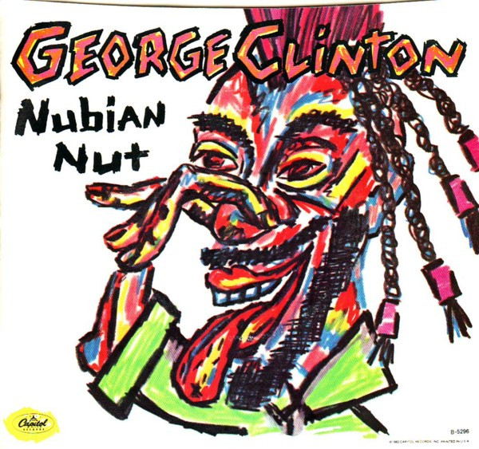

# Nubian Nut

By George Clinton

## Album Data

[Discogs URL](https://www.discogs.com/release/4146523-George-Clinton-Nubian-Nut)

- Catalog #: B-5296
- Label: Capitol Records
- Format: 7", Single, Win
- Rating: 
- Released: 1983
- Release ID: 4146523
- Media condition: Very Good Plus (VG+)
- Sleeve condition: Very Good Plus (VG+)
- Speed: 45 rpm
- Weight: 

## Album Tracks

| **Position** | **Title** | **Duration** |
|--------------|-----------|--------------|
| A | **Nubian Nut** | 4:10 |
| B | **Free Alterations** | 4:15 |

## Artist Roles

| **Name** | **Role** |
|----------|----------|
| **Eddy Schreyer** | Lacquer Cut By |

## See also

- [Last Dance](Last_Dance.md)
