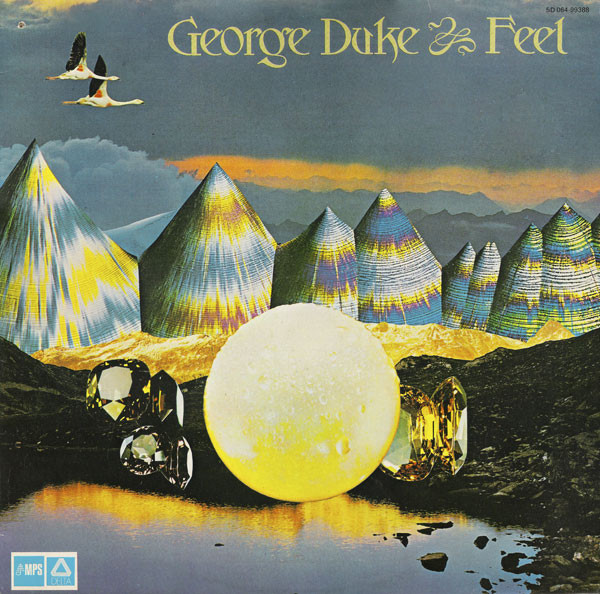

# Feel

By George Duke

## Album Data

[Discogs URL](https://www.discogs.com/release/1924523-George-Duke-Feel)

- Catalog #: 5D 064-99388
- Label: MPS Records, Delta (2)
- Format: LP, Album, RE
- Rating: 
- Released: 1977
- Release ID: 1924523
- Media condition: Very Good Plus (VG+)
- Sleeve condition: Very Good Plus (VG+)
- Speed: 33 rpm
- Weight: 

## Album Tracks

| **Position** | **Title** | **Duration** |
|--------------|-----------|--------------|
| A1 | **Funny Funk** | 5:18 |
| A2 | **Love** | 6:06 |
| A3 | **The Once Over** | 4:39 |
| A4 | **Feel** | 5:40 |
| B1 | **Cora Joberge** | 3:50 |
| B2 | **Old Slippers** | 5:41 |
| B3 | **Theme From The Opera "Tzina"** | 2:01 |
| B4 | **Yana Aminah** | 4:33 |
| B5 | **Rashid** | 3:36 |
| B6 | **Statement** | 1:15 |

## See also

- [Reach For It](Reach_For_It.md)
