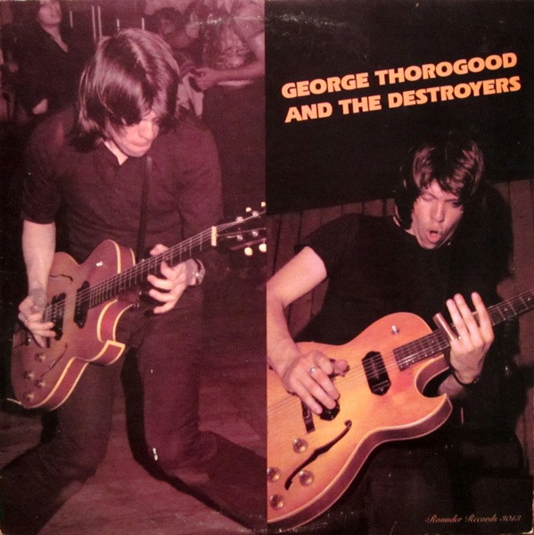

# George Thorogood And The Destroyers

By George Thorogood & The Destroyers

## Album Data

[Discogs URL](https://www.discogs.com/release/919875-George-Thorogood-&-The-Destroyers-George-Thorogood-And-The-Destroyers)

- Catalog #: 3013
- Label: Rounder Records
- Formats: Vinyl
- Format: LP, Album
- Rating: 
- Released: 1977
- Year: 1977
- Release ID: 919875
- Media condition: Very Good Plus (VG+)
- Sleeve condition: Very Good Plus (VG+)
- Speed: 33 rpm
- Weight: 

## Album Tracks

| **Position** | **Title** | **Duration** |
|--------------|-----------|--------------|
| A1 | **You Got To Lose** | 3:15 |
| A2 | **Madison Blues** | 4:24 |
| A3 | **One Bourbon, One Scotch, One Beer** | 8:20 |
| A4 | **Kind Hearted Woman** | 3:48 |
| A5 | **Can't Stop Lovin** | 3:04 |
| B1 | **Ride On Josephine** | 4:17 |
| B2 | **Homesick Boy** | 3:02 |
| B3 | **John Hardy** | 3:18 |
| B4 | **I'll Change My Style** | 3:57 |
| B5 | **Delaware Slide** | 7:45 |

## Artist Roles

| **Name** | **Role** |
|----------|----------|
| **George Thorogood** | Acoustic Guitar, Electric Guitar, Harmonica, Lead Vocals |
| **Bill Blough** | Bass |
| **Susan Marsh** | Design |
| **Jeff Simon** | Drums |
| **John Nagy** | Engineer, Mixed By [Mixdown] |
| **Ron Smith (3)** | Guitar [Second] |
| **Henry Horenstein** | Photography By [Color Photography] |
| **Sam Clover** | Photography By [On Back Sleeve, Left Side] |

## See also

- 
