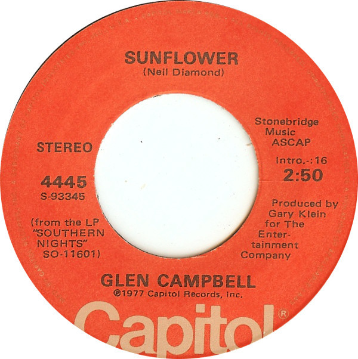

# Sunflower

By Glen Campbell

## Album Data

[Discogs URL](https://www.discogs.com/release/3063022-Glen-Campbell-Sunflower)

- Catalog #: 4445
- Label: Capitol Records
- Format: 7", Single, Jac
- Rating: 
- Released: 1977
- Release ID: 3063022
- Media condition: Very Good Plus (VG+)
- Sleeve condition: 
- Speed: 45 rpm
- Weight: 

