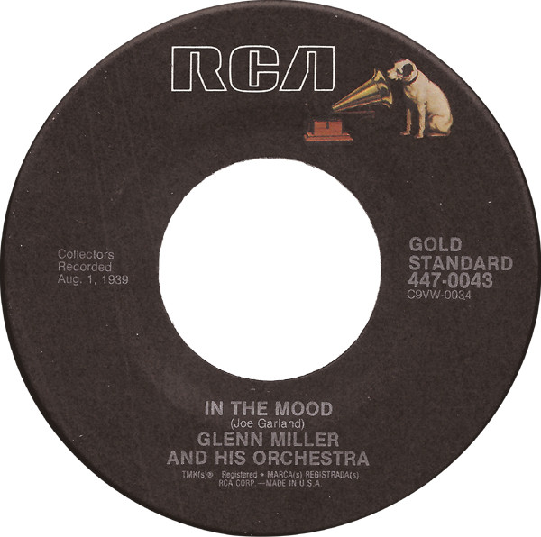

# In The Mood / A String Of Pearls

By Glenn Miller And His Orchestra

## Album Data

[Discogs URL](https://www.discogs.com/release/2416792-Glenn-Miller-And-His-Orchestra-In-The-Mood-/-A-String-Of-Pearls)

- Catalog #: 447-0043
- Label: RCA, BMG
- Format: 7", RE, Ind
- Rating: 
- Released: 1989
- Release ID: 2416792
- Media condition: Very Good Plus (VG+)
- Sleeve condition: 
- Speed: 45 rpm
- Weight: 

