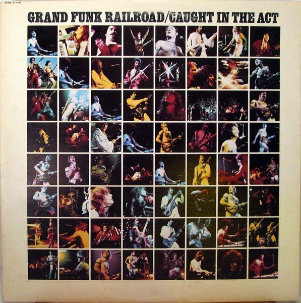

# Caught In The Act

By Grand Funk Railroad

## Album Data

[Discogs URL](https://www.discogs.com/release/4966050-Grand-Funk-Railroad-Caught-In-The-Act)

- Catalog #: SABB-511445
- Label: Capitol Records
- Format: 2xLP, Album, Club, San
- Rating: 
- Released: 1975
- Release ID: 4966050
- Media condition: Good (G)
- Sleeve condition: Poor (P)
- Speed: 33 rpm
- Weight: 

## See also

- [E Pluribus Funk](E_Pluribus_Funk.md)
- [We're An American Band](Were_An_American_Band.md)
