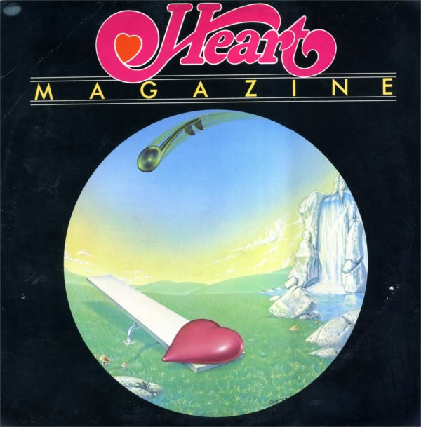

# Magazine

By Heart

## Album Data

[Discogs URL](https://www.discogs.com/release/412737-Heart-Magazine)

- Catalog #: MRS-5008
- Label: Mushroom Records (5)
- Formats: Vinyl, Terre Haute Pressing
- Format: LP, Album, RE, San
- Rating: 
- Released: 1978
- Year: 1977
- Release ID: 412737
- Media condition: Good Plus (G+)
- Sleeve condition: Good Plus (G+)
- Speed: 33 rpm
- Weight: 

## Album Tracks

| **Position** | **Title** | **Duration** |
|--------------|-----------|--------------|
| A1 | **Heartless** | 4:59 |
| A2 | **Devil Delight** | 4:58 |
| A3 | **Just The Wine** | 4:15 |
| A4 | **Without You** | 4:43 |
| B1 | **Magazine** | 6:19 |
| B2 | **Here Song** | 1:34 |
| B3 | **Mother Earth Blues** | 5:42 |
| B4 | **I've Got The Music In Me** | 6:01 |

## Artist Roles

| **Name** | **Role** |
|----------|----------|
| **Nancy Wilson (2)** | Acoustic Guitar, Electric Guitar, Blues Harp, Vocals |
| **Howard Leese** | Arranged By [Strings], Conductor [Strings] |
| **Loren Salazar** | Artwork [Front Cover] |
| **Steve Fossen** | Bass, Vocals |
| **Michael Derosier** | Drums |
| **Mike Flicker** | Engineer |
| **Rick Keefer** | Engineer |
| **Larry Green (3)** | Engineer [Assistant Engineer] |
| **Rolf Hennemann** | Engineer [Assistant Engineer] |
| **Terry Gottlieb** | Engineer [Assistant Engineer] |
| **Howard Leese** | Guitar, Keyboards, Vocals |
| **John Golden** | Lacquer Cut By |
| **Roger Fisher (2)** | Lead Guitar |
| **Ann Wilson** | Lead Vocals, Flute, Acoustic Guitar |
| **Ann Wilson** | Lyrics By |
| **Nancy Wilson (2)** | Lyrics By |
| **Ken Kinnear** | Management |
| **Mike Flicker** | Producer |
| **Heart** | Producer [Production Assistance] |
| **Mike Fisher (2)** | Producer [Production Assistance] |
| **Mike Fisher (2)** | Producer [Special Direction] |

## See also

- [Dog & Butterfly](Dog_and_Butterfly.md)
- [Dreamboat Annie](Dreamboat_Annie.md)
- [Little Queen](Little_Queen.md)
- [Beets: Dog & Butterfly](../../Beets/Heart/Dog_and_Butterfly.md)
- [Beets: Dreamboat Annie](../../Beets/Heart/Dreamboat_Annie.md)
- [Beets: Secret Heart Illustrated](../../Beets/Heart/Secret_Heart_Illustrated.md)
- [Roon: Alive in Seattle (Live)](../../Roon/Heart/Alive_in_Seattle_Live.md)
- [Roon: Beautiful Broken](../../Roon/Heart/Beautiful_Broken.md)
- [Roon: Dog & Butterfly](../../Roon/Heart/Dog_and_Butterfly.md)
- [Roon: Dreamboat Annie](../../Roon/Heart/Dreamboat_Annie.md)
- [Roon: Little Queen](../../Roon/Heart/Little_Queen.md)
