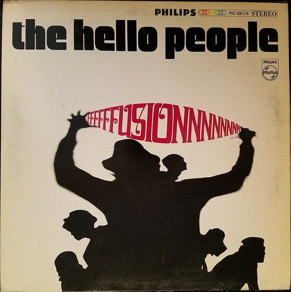

# Fusion

By Hello People

## Album Data

[Discogs URL](https://www.discogs.com/release/3037337-Hello-People-Fusion)

- Catalog #: PHS 600-276
- Label: Philips
- Format: LP, Album, Ter
- Rating: 
- Released: 1968
- Release ID: 3037337
- Media condition: Good Plus (G+)
- Sleeve condition: Good Plus (G+)
- Speed: 33 rpm
- Weight: 

## Album Tracks

| **Position** | **Title** | **Duration** |
|--------------|-----------|--------------|
| A1 | **White Winged Doves** | 4:11 |
| A2 | **Anthem** | 4:01 |
| A3 | **Jelly Jam** | 4:00 |
| A4 | **If I Should Sing Too Softly** | 3:16 |
| A5 | **How Does It Feel To Be Free** | 3:41 |
| B1 | **Pray For Rain** | 2:53 |
| B2 | **A Dream Of Tomorrow** | 4:18 |
| B3 | **Everything's Better** | 3:17 |
| B4 | **Come And See Me** | 6:38 |
| B5 | **I Ride To Nowhere** | 3:06 |

## See also

- [Bricks](Bricks.md)
- [The Handsome Devils](The_Handsome_Devils.md)
- [The Hello People](The_Hello_People.md)
- [Beets: Bricks](../../Beets/Hello_People/Bricks.md)
- [Beets: Fusion](../../Beets/Hello_People/Fusion.md)
- [Beets: Hello People](../../Beets/Hello_People/Hello_People.md)
- [Beets: The Handsome Devils](../../Beets/Hello_People/The_Handsome_Devils.md)
