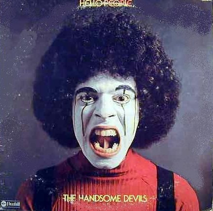

# The Handsome Devils

By Hello People

## Album Data

[Discogs URL](https://www.discogs.com/release/821820-Hello-People-The-Handsome-Devils)

- Catalog #: DSD-50184
- Label: ABC Dunhill
- Format: LP, Album
- Rating: 
- Released: 1974
- Release ID: 821820
- Media condition: Very Good (VG)
- Sleeve condition: Very Good Plus (VG+)
- Speed: 33 rpm
- Weight: 

## Album Tracks

| **Position** | **Title** | **Duration** |
|--------------|-----------|--------------|
| A1 | **Future Shock** | 4:41 |
| A2 | **Finger Poppin' Time** | 2:41 |
| A3 | **Take The Love In Your Body** | 2:44 |
| A4 | **Destiny** | 3:57 |
| A5 | **Ripped Again** | 6:06 |
| B1 | **Listen To Your Heart** | 2:13 |
| B2 | **Creego** | 3:24 |
| B3 | **Cry Baby** | 3:05 |
| B4 | **Just One Victory** | 4:14 |
| B5 | **How High Is The Moon** | 3:14 |
| B6 | **Save A Dance For Me** | 3:18 |

## Artist Roles

| **Name** | **Role** |
|----------|----------|
| **Tim Bryant (2)** | Design |
| **David Le Sage** | Engineer [Assistant] |
| **Ron Slenzak** | Photography By |
| **Todd Rundgren** | Producer, Engineer |
| **Bobby Sedita** | Written-By |
| **Greg Geddes** | Written-By |
| **Larry Tasse** | Written-By |
| **N.D. Smart II** | Written-By |

## See also

- [Bricks](Bricks.md)
- [Fusion](Fusion.md)
- [The Hello People](The_Hello_People.md)
- [Beets: Bricks](../../Beets/Hello_People/Bricks.md)
- [Beets: Fusion](../../Beets/Hello_People/Fusion.md)
- [Beets: Hello People](../../Beets/Hello_People/Hello_People.md)
- [Beets: The Handsome Devils](../../Beets/Hello_People/The_Handsome_Devils.md)
