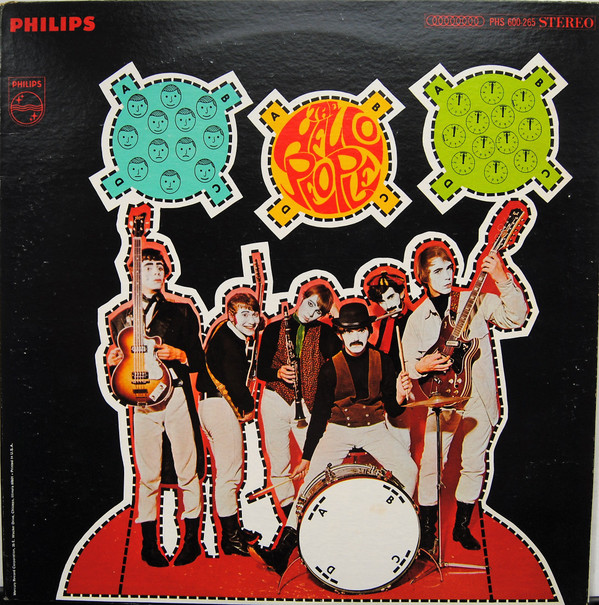

# The Hello People

By Hello People

## Album Data

[Discogs URL](https://www.discogs.com/release/2529835-Hello-People-The-Hello-People)

- Catalog #: PHS 600-265
- Label: Philips
- Format: LP, Album
- Rating: 
- Released: 1968
- Release ID: 2529835
- Media condition: Very Good (VG)
- Sleeve condition: Very Good (VG)
- Speed: 33 rpm
- Weight: 

## Album Tracks

| **Position** | **Title** | **Duration** |
|--------------|-----------|--------------|
| A1 | **It's A Monday Kind Of Tuesday** | 3:28 |
| A2 | **Sunrise Meadow** | 5:15 |
| A3 | **A Stranger At Her Door** | 3:42 |
| A4 | **Movin' And Growin'** | 3:37 |
| B1 | **Paisley Teddy Bear** | 2:45 |
| B2 | **(As I Went Down To) Jerusalem** | 4:10 |
| B3 | **Lamplight, Nightlight** | 4:30 |
| B4 | **Mr. Truth Evading, Masquerading Man** | 2:20 |
| B5 | **Paris In The Rain** | 4:51 |

## See also

- [Bricks](Bricks.md)
- [Fusion](Fusion.md)
- [The Handsome Devils](The_Handsome_Devils.md)
- [Beets: Bricks](../../Beets/Hello_People/Bricks.md)
- [Beets: Fusion](../../Beets/Hello_People/Fusion.md)
- [Beets: Hello People](../../Beets/Hello_People/Hello_People.md)
- [Beets: The Handsome Devils](../../Beets/Hello_People/The_Handsome_Devils.md)
