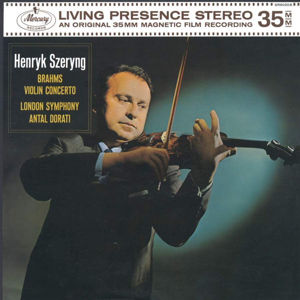

# Violin Concerto

By "Henryk Szeryng, Johannes Brahms, The London Symphony Orchestra, Antal Dorati"

## Album Data

[Discogs URL](https://www.discogs.com/release/4121140-"Henryk-Szeryng,-Johannes-Brahms,-The-London-Symphony-Orchestra,-Antal-Dorati"-Violin-Concerto)

- Catalog #: 483 0496, SR90308
- Label: Decca, Mercury Living Presence, Mercury
- Formats: Vinyl, 180g
- Format: LP, RE, RM, 180
- Rating: 
- Released: 2016
- Year: 1962
- Release ID: 4121140
- Media condition: Mint (M)
- Sleeve condition: Mint (M)
- Speed: 33 rpm
- Weight: 180 gram

## Album Tracks

| **Position** | **Title** | **Duration** |
|--------------|-----------|--------------|
|  | **Violin Concerto In D Major, Opus 77** |  |

## Artist Roles

| **Name** | **Role** |
|----------|----------|
| **Johannes Brahms** | Composed By |
| **Antal Dorati** | Conductor |
| **George Maas** | Design [Cover] |
| **The London Symphony Orchestra** | Orchestra |
| **Angus McBean** | Photography By [Cover] |
| **Harold Lawrence** | Producer |
| **James Lyons** | Sleeve Notes |
| **Henryk Szeryng** | Violin |

## See also

- 
