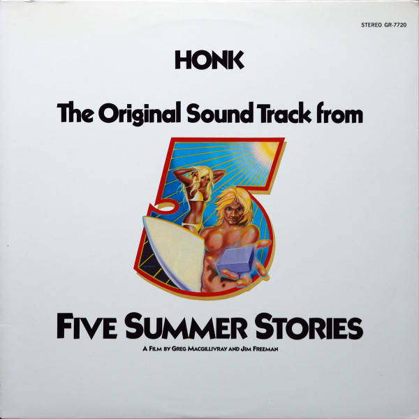

# The Original Sound Track from Five Summer Stories

By Honk

## Album Data

[Discogs URL](https://www.discogs.com/release/7705961-Honk-(2)-The-Original-Sound-Track-from-Five-Summer-Stories)

- Catalog #: GR-7720, GR 7720
- Label: Granite Records, Granite Records
- Format: LP, Album
- Rating: 
- Released: 1972
- Release ID: 7705961
- Media condition: Very Good Plus (VG+)
- Sleeve condition: Very Good (VG)
- Speed: 33 rpm
- Weight: 

