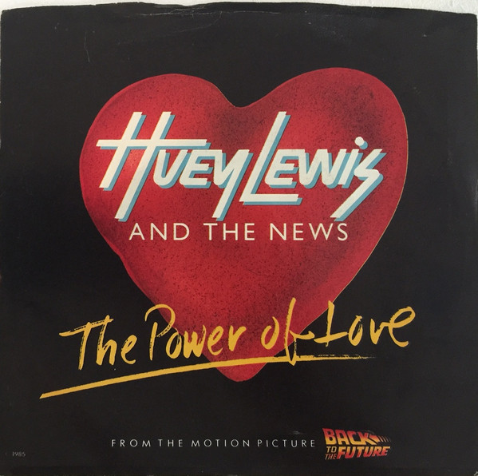

# The Power Of Love

By Huey Lewis & The News

## Album Data

[Discogs URL](https://www.discogs.com/release/8445706-Huey-Lewis-&-The-News-The-Power-Of-Love)

- Catalog #: VS4-42876, VS4 42876
- Label: Chrysalis, Chrysalis
- Formats: Vinyl
- Format: 7", Single, Styrene, 45 RPM
- Rating: 
- Released: 1985
- Year: 1985
- Release ID: 8445706
- Media condition: Very Good Plus (VG+)
- Sleeve condition: Very Good Plus (VG+)
- Speed: 45 rpm
- Weight: 

## Album Tracks

| **Position** | **Title** | **Duration** |
|--------------|-----------|--------------|
| A | **The Power Of Love** | 3:53 |
| B | **Bad Is Bad** | 3:46 |

## Artist Roles

| **Name** | **Role** |
|----------|----------|
| **Huey Lewis & The News** | Producer |

## See also

- 
