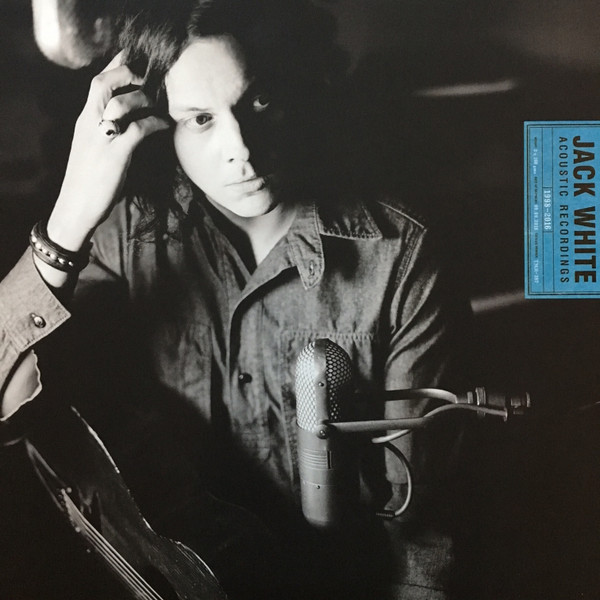

# Acoustic Recordings 1998-2016

By Jack White

## Album Data

[Discogs URL](https://www.discogs.com/release/9017932-Jack-White-(2)-Acoustic-Recordings-1998-2016)

- Catalog #: TMR-387
- Label: Third Man Records
- Formats: Vinyl, 180 gram
- Format: 2xLP, Album, RM, 180
- Rating: 
- Released: 2016
- Year: 2016
- Release ID: 9017932
- Media condition: Mint (M)
- Sleeve condition: Near Mint (NM or M-)
- Speed: 33 rpm
- Weight: 180 gram

## Album Tracks

| **Position** | **Title** | **Duration** |
|--------------|-----------|--------------|
| A1 | **Sugar Never Tasted So Good** | 2:56 |
| A2 | **Apple Blossom (Remixed)** | 2:13 |
| A3 | **I'm Bound To Pack It Up (Remixed)** | 3:11 |
| A4 | **Hotel Yorba (Live At The Hotel Yorba)** | 2:15 |
| A5 | **We're Going To Be Friends** | 2:23 |
| A6 | **You've Got Her In Your Pocket** | 3:41 |
| A7 | **Well, It's True That We Love One Another** | 2:43 |
| A8 | **Never Far Away** | 3:40 |
| B9 | **Forever For Her (Is Over For Me)** | 3:16 |
| B10 | **White Moon** | 4:02 |
| B11 | **As Ugly As I Seem** | 4:11 |
| B12 | **City Lights (Previously Unreleased White Stripes Track)** | 4:54 |
| B13 | **Honey, We Can't Afford To Look This Cheap** | 3:57 |
| B14 | **Effect & Cause** | 3:01 |
| C15 | **Love Is The Truth (Acoustic Mix)** | 1:39 |
| C16 | **Top Yourself (Bluegrass Version)** | 4:40 |
| C17 | **Carolina Drama (Acoustic Mix)** | 5:51 |
| C18 | **Love Interruption ** | 2:39 |
| C19 | **On And On And On** | 3:56 |
| C20 | **Machine Gun Silhouette (Acoustic Mix)** | 3:04 |
| D21 | **Blunderbuss** | 3:07 |
| D22 | **Hip (Eponymous) Poor Boy (Alternate Mix)** | 3:03 |
| D23 | **I Guess I Should Go To Sleep (Alternate Mix)** | 2:37 |
| D24 | **Just One Drink (Acoustic Mix)** | 2:33 |
| D25 | **Entitlement** | 4:08 |
| D26 | **Want And Able** | 2:35 |

## Artist Roles

| **Name** | **Role** |
|----------|----------|
| **Jack White (2)** | Art Direction, Design |
| **Nathanio Strimpopulos** | Art Direction, Design |
| **George Ingram** | Lacquer Cut By |
| **Greil Marcus** | Liner Notes |
| **Ian Montone** | Management |
| **Monotone, Inc.** | Management |
| **Autumn DeWilde** | Photography By [Insert Back Cover] |
| **Molly Moormeier** | Photography By [Insert Last Page] |
| **Jo McCaughey** | Photography By [Jacket Front & Rear Cover] |
| **David Swanson (5)** | Photography By [Jacket Interior & Insert Front Cover] |
| **Jack White (2)** | Producer |
| **Andrew Mendelson** | Remastered By |
| **Jack White (2)** | Songwriter [All Songs Written By] |

## See also

- [Lazaretto](Lazaretto.md)
- [Beets: Acoustic Recordings 1998–2016](../../Beets/Jack_White/Acoustic_Recordings_1998–2016.md)
- [Beets: Blunderbuss](../../Beets/Jack_White/Blunderbuss.md)
- [Beets: Bonnaroo 2014](../../Beets/Jack_White/Bonnaroo_2014.md)
- [Beets: Lazaretto](../../Beets/Jack_White/Lazaretto.md)
- [CD: Blunderbuss](../../CD/Jack_White/Blunderbuss.md)
- [CD: ](../../CD/Jack_White/Jack_White.md)
- [Roon: Blunderbuss](../../Roon/Jack_White/Blunderbuss.md)
- [Roon: Fear Of The Dawn](../../Roon/Jack_White/Fear_Of_The_Dawn.md)
- [Roon: Jack White Acoustic Recordings 1998 - 2016](../../Roon/Jack_White/Jack_White_Acoustic_Recordings_1998_-_2016.md)
- [Roon: Lazaretto](../../Roon/Jack_White/Lazaretto.md)
