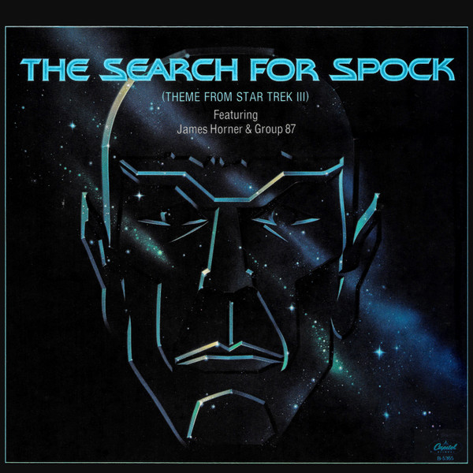

# "The Search For Spock (Theme From ""Star Trek III"")"

By "James Horner, Group 87"

## Album Data

[Discogs URL](https://www.discogs.com/release/3280851-"James-Horner,-Group-87"-"The-Search-For-Spock-(Theme-From-""Star-Trek-III"")")

- Catalog #: B-5365
- Label: Capitol Records
- Format: 7", Single
- Rating: 
- Released: 1984
- Release ID: 3280851
- Media condition: Very Good Plus (VG+)
- Sleeve condition: Very Good Plus (VG+)
- Speed: 45 rpm
- Weight: 

