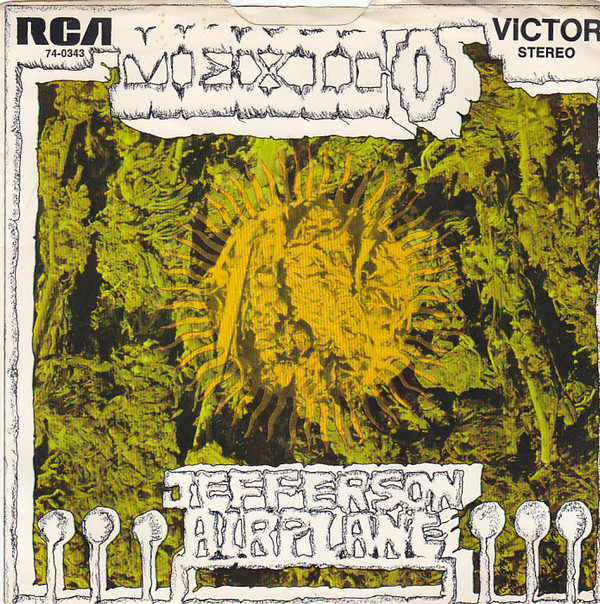

# Mexico

By Jefferson Airplane

## Album Data

[Discogs URL](https://www.discogs.com/release/7327717-Jefferson-Airplane-Mexico)

- Catalog #: 74-0343
- Label: RCA Victor
- Formats: Vinyl
- Format: 7", Single
- Rating: 
- Released: 1970
- Year: 1970
- Release ID: 7327717
- Media condition: Very Good (VG)
- Sleeve condition: Very Good Plus (VG+)
- Speed: 
- Weight: 

## Album Tracks

| **Position** | **Title** | **Duration** |
|--------------|-----------|--------------|
| A | **Mexico** | 2:07 |
| B | **Have You Seen The Saucers** | 3:37 |

## See also

- [After Bathing At Baxter's](After_Bathing_At_Baxters.md)
- [Crown Of Creation](Crown_Of_Creation.md)
- [Surrealistic Pillow](Surrealistic_Pillow.md)
- [Beets: After Bathing at Baxter's](../../Beets/Jefferson_Airplane/After_Bathing_at_Baxters.md)
- [Beets: After Bathing At Baxter's](../../Beets/Jefferson_Airplane/After_Bathing_At_Baxters.md)
- [Beets: Bark](../../Beets/Jefferson_Airplane/Bark.md)
- [Beets: Bless Its Pointed Little Head](../../Beets/Jefferson_Airplane/Bless_Its_Pointed_Little_Head.md)
- [Beets: Crown of Creation](../../Beets/Jefferson_Airplane/Crown_of_Creation.md)
- [Beets: Early Flight](../../Beets/Jefferson_Airplane/Early_Flight.md)
- [Beets: Jefferson Airplane](../../Beets/Jefferson_Airplane/Jefferson_Airplane.md)
- [Beets: Jefferson Airplane Takes Off](../../Beets/Jefferson_Airplane/Jefferson_Airplane_Takes_Off.md)
- [Beets: Live at Fillmore West 11-25 thru 11-27 1966](../../Beets/Jefferson_Airplane/Live_at_Fillmore_West_11-25_thru_11-27_1966.md)
- [Beets: Long John Silver](../../Beets/Jefferson_Airplane/Long_John_Silver.md)
- [Beets: Return To The Matrix](../../Beets/Jefferson_Airplane/Return_To_The_Matrix.md)
- [Beets: Surrealistic Pillow](../../Beets/Jefferson_Airplane/Surrealistic_Pillow.md)
- [Beets: Sweeping Up the Spotlight](../../Beets/Jefferson_Airplane/Sweeping_Up_the_Spotlight.md)
- [Beets: The Essential Jefferson Airplane - Amazon Prime](../../Beets/Jefferson_Airplane/The_Essential_Jefferson_Airplane_-_Amazon_Prime.md)
- [Beets: Thirty Seconds Over Winterland](../../Beets/Jefferson_Airplane/Thirty_Seconds_Over_Winterland.md)
- [Beets: Volunteers](../../Beets/Jefferson_Airplane/Volunteers.md)
- [CD: After Bathing At Baxter's](../../CD/Jefferson_Airplane/After_Bathing_At_Baxters.md)
- [CD: Bark](../../CD/Jefferson_Airplane/Bark.md)
- [CD: Early Flight Thirty Seconds Over Winterland](../../CD/Jefferson_Airplane/Early_Flight_Thirty_Seconds_Over_Winterland.md)
- [CD: ](../../CD/Jefferson_Airplane/Jefferson_Airplane.md)
- [CD: Long John Silver](../../CD/Jefferson_Airplane/Long_John_Silver.md)
- [CD: Original Album Classics (Disc 1)](../../CD/Jefferson_Airplane/Original_Album_Classics_Disc_1.md)
- [Roon: After Bathing At Baxters](../../Roon/Jefferson_Airplane/After_Bathing_At_Baxters.md)
- [Roon: Bark (Bonus Tracks)](../../Roon/Jefferson_Airplane/Bark_Bonus_Tracks.md)
- [Roon: Bless Its Pointed Little Head](../../Roon/Jefferson_Airplane/Bless_Its_Pointed_Little_Head.md)
- [Roon: Crown Of Creation](../../Roon/Jefferson_Airplane/Crown_Of_Creation.md)
- [Roon: Long John Silver](../../Roon/Jefferson_Airplane/Long_John_Silver.md)
- [Roon: Surrealistic Pillow](../../Roon/Jefferson_Airplane/Surrealistic_Pillow.md)
- [Roon: Thirty Seconds Over Winterland [Live] (Expanded Edition)](../../Roon/Jefferson_Airplane/Thirty_Seconds_Over_Winterland_[Live]_Expanded_Edition.md)
- [Roon: Volunteers](../../Roon/Jefferson_Airplane/Volunteers.md)
