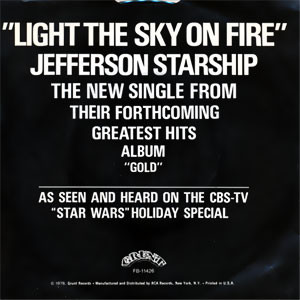

# Light The Sky On Fire

By Jefferson Starship

## Album Data

[Discogs URL](https://www.discogs.com/release/5562004-Jefferson-Starship-Light-The-Sky-On-Fire)

- Catalog #: FB-11426
- Label: Grunt (3)
- Format: 7"
- Rating: 
- Released: 1979
- Release ID: 5562004
- Media condition: Very Good Plus (VG+)
- Sleeve condition: Generic
- Speed: 45 rpm
- Weight: 

## See also

- [Count On Me / Show Yourself](Count_On_Me_-_Show_Yourself.md)
- [Crazy Feelin'](Crazy_Feelin.md)
- [Red Octopus](Red_Octopus.md)
- [Beets: Blows Against the Empire](../../Beets/Jefferson_Starship/Blows_Against_the_Empire.md)
- [Beets: Dragonfly](../../Beets/Jefferson_Starship/Dragonfly.md)
- [Beets: Freedom At Point Zero](../../Beets/Jefferson_Starship/Freedom_At_Point_Zero.md)
- [Beets: Jefferson Starship Live at Boston Music Hall](../../Beets/Jefferson_Starship/Jefferson_Starship_Live_at_Boston_Music_Hall.md)
- [Beets: Jefferson Starship - The Box Set Series](../../Beets/Jefferson_Starship/Jefferson_Starship_-_The_Box_Set_Series_2_3.md)
- [Beets: Jefferson Starship - The Box Set Series](../../Beets/Jefferson_Starship/Jefferson_Starship_-_The_Box_Set_Series_2.md)
- [Beets: Jefferson Starship - The Box Set Series](../../Beets/Jefferson_Starship/Jefferson_Starship_-_The_Box_Set_Series.md)
- [Beets: Red Octopus](../../Beets/Jefferson_Starship/Red_Octopus.md)
- [Beets: SNACK Benefit, Kezar Stadium March 23, 1975](../../Beets/Jefferson_Starship/SNACK_Benefit__Kezar_Stadium_March_23__1975.md)
- [Beets: Spitfire](../../Beets/Jefferson_Starship/Spitfire.md)
- [Beets: Winds of Change](../../Beets/Jefferson_Starship/Winds_of_Change.md)
- [CD: Freedom At Point Zero](../../CD/Jefferson_Starship/Freedom_At_Point_Zero.md)
- [CD: ](../../CD/Jefferson_Starship/Jefferson_Starship.md)
- [CD: Spitfire](../../CD/Jefferson_Starship/Spitfire.md)
- [CD: Winds Of Change](../../CD/Jefferson_Starship/Winds_Of_Change.md)
- [Roon: Blows Against The Empire](../../Roon/Jefferson_Starship/Blows_Against_The_Empire.md)
- [Roon: Deeper Space, Extra Virgin Sky](../../Roon/Jefferson_Starship/Deeper_Space__Extra_Virgin_Sky.md)
- [Roon: Dragon Fly](../../Roon/Jefferson_Starship/Dragon_Fly.md)
- [Roon: Modern Times](../../Roon/Jefferson_Starship/Modern_Times.md)
- [Roon: Red Octopus](../../Roon/Jefferson_Starship/Red_Octopus.md)
- [Roon: Spitfire (Remastered)](../../Roon/Jefferson_Starship/Spitfire_Remastered.md)
- [Roon: The Box Set Series](../../Roon/Jefferson_Starship/The_Box_Set_Series.md)
- [Roon: Timeless Classics Live](../../Roon/Jefferson_Starship/Timeless_Classics_Live.md)
- [Roon: Winds Of Change](../../Roon/Jefferson_Starship/Winds_Of_Change.md)
