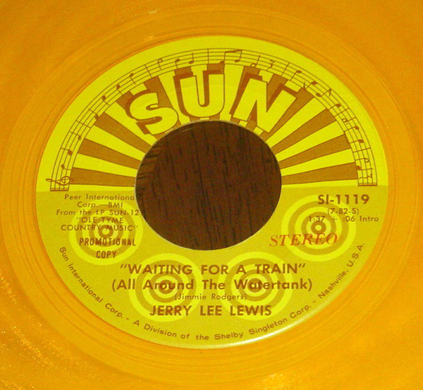

# Waiting For A Train (All Around The Watertank)

By Jerry Lee Lewis

## Album Data

[Discogs URL](https://www.discogs.com/release/6130443-Jerry-Lee-Lewis-Waiting-For-A-Train-(All-Around-The-Watertank))

- Catalog #: SI-1119
- Label: Sun (9)
- Formats: Vinyl, Yellow
- Format: 7", Single, Promo, Yel
- Rating: 
- Released: 1970
- Year: 1970
- Release ID: 6130443
- Media condition: Very Good Plus (VG+)
- Sleeve condition: 
- Speed: 45 rpm
- Weight: 

## Album Tracks

| **Position** | **Title** | **Duration** |
|--------------|-----------|--------------|
| A | **Waiting For A Train (All Around The Watertank) (Stereo)** | 1:37 |
| B | **Waiting For A Train (All Around The Watertank) (Mono)** | 1:37 |

## See also

- [The Session Recorded In London With Great Guest Artists](The_Session_Recorded_In_London_With_Great_Guest_Artists.md)
- [Beets: The Session...Recorded in London with Great Artists](../../Beets/Jerry_Lee_Lewis/The_SessionRecorded_in_London_with_Great_Artists.md)
