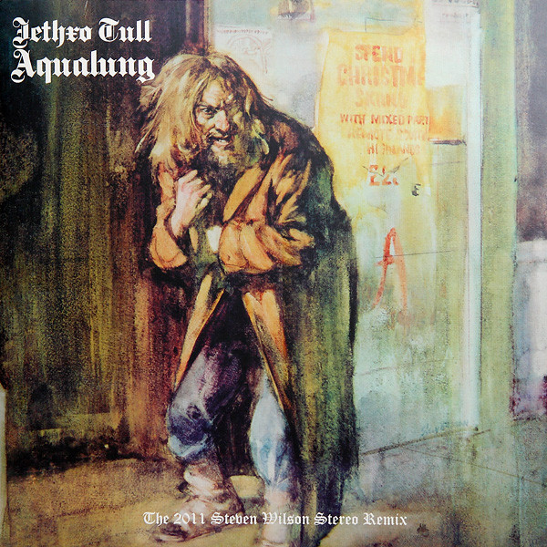

# Aqualung (The 2011 Steven Wilson Stereo Remix)

By Jethro Tull

## Album Data

[Discogs URL](https://www.discogs.com/release/7041910-Jethro-Tull-Aqualung-(The-2011-Steven-Wilson-Stereo-Remix))

- Catalog #: 0825646146604, AQUA 1
- Label: Chrysalis, Chrysalis
- Formats: Vinyl, 180g, Gatefold
- Format: LP, Album, RE, RP, 180
- Rating: 
- Released: 2015
- Year: 1971
- Release ID: 7041910
- Media condition: Mint (M)
- Sleeve condition: Mint (M)
- Speed: 33 rpm
- Weight: 180 gram

## Album Tracks

| **Position** | **Title** | **Duration** |
|--------------|-----------|--------------|
|  | **Aqualung** |  |
| A1 | **Aqualung** |  |
| A2 | **Cross-Eyed Mary** |  |
| A3 | **Cheap Day Return** |  |
| A4 | **Mother Goose** |  |
| A5 | **Wond'ring Aloud** |  |
| A6 | **Up To Me** |  |
|  | **My God** |  |
| B1 | **My God** |  |
| B2 | **Hymn 43** |  |
| B3 | **Slipstream** |  |
| B4 | **Locomotive Breath** |  |
| B5 | **Wind-Up** |  |

## Artist Roles

| **Name** | **Role** |
|----------|----------|
| **David Palmer (2)** | Arranged By [Orchestra Arranged By], Conductor [Orchestra Conducted By] |
| **Jeffrey Hammond-Hammond** | Bass Guitar, Alto Recorder, Voice [Odd Voices] |
| **Darren Evans (2)** | Design |
| **Clive Bunker** | Drums [A Thousand Drums], Percussion |
| **Martin Barre** | Electric Guitar, Recorder [Descant Recorder] |
| **John Burns** | Engineer |
| **Ian Anderson** | Flute, Acoustic Guitar, Voice |
| **John Burns** | Interviewee [Q & A] |
| **CCS (2)** | Layout [Original Layout By] |
| **Steven Wilson** | Liner Notes |
| **Dom Lawson** | Liner Notes, Interviewer [Interviews] |
| **Helen Owens** | Management [Marketing By] |
| **Peter Mew** | Mastered By [Mastering By] |
| **Steven Wilson** | Mixed By [New Stereo Mixes By] |
| **Burton Silverman** | Painting [Paintings By] |
| **Barry Plummer** | Photography By |
| **Bubi Heilemann** | Photography By |
| **Michael Putland** | Photography By |
| **Norbert Unfried** | Photography By |
| **John Evan** | Piano, Organ, Mellotron |
| **Ian Anderson** | Producer [Produced By] |
| **Terry Ellis** | Producer [Produced By] |
| **Don Needham** | Research [Additional Research By] |
| **Tim Chacksfield** | Research [Project Research], Coordinator [Project Co-ordination] |
| **Kris Burton** | Transferred By [Muti Track Transfers By] |
| **Ian Anderson** | Written-By |

## See also

- [Minstrel In The Gallery (40th Anniversary LP Édition)](Minstrel_In_The_Gallery_40th_Anniversary_LP_Édition.md)
- [Songs From The Wood](Songs_From_The_Wood.md)
- [Thick As A Brick](Thick_As_A_Brick.md)
- [Beets: 20 Years of Jethro Tull Disc 1](../../Beets/Jethro_Tull/20_Years_of_Jethro_Tull_Disc_1.md)
- [Beets: 20 Years of Jethro Tull Disc 2](../../Beets/Jethro_Tull/20_Years_of_Jethro_Tull_Disc_2.md)
- [Beets: 20 Years of Jethro Tull Disc 3](../../Beets/Jethro_Tull/20_Years_of_Jethro_Tull_Disc_3.md)
- [Beets: A Passion Play](../../Beets/Jethro_Tull/A_Passion_Play.md)
- [Beets: A Passion Play (Steven Wilson mix) DVD rip](../../Beets/Jethro_Tull/A_Passion_Play_Steven_Wilson_mix_DVD_rip.md)
- [Beets: A Passion Play (Steven Wilson mix)](../../Beets/Jethro_Tull/A_Passion_Play_Steven_Wilson_mix.md)
- [Beets: Aqualung 40th Anniversary Adapted Edition](../../Beets/Jethro_Tull/Aqualung_40th_Anniversary_Adapted_Edition.md)
- [Beets: Aqualung](../../Beets/Jethro_Tull/Aqualung.md)
- [Beets: J-Tull Dot Com](../../Beets/Jethro_Tull/J-Tull_Dot_Com.md)
- [Beets: Live in Concert at Landover 1977](../../Beets/Jethro_Tull/Live_in_Concert_at_Landover_1977.md)
- [Beets: Minstrel in the Gallery](../../Beets/Jethro_Tull/Minstrel_in_the_Gallery.md)
- [Beets: Songs From The Wood (40th Anniversary Edition)](../../Beets/Jethro_Tull/Songs_From_The_Wood_40th_Anniversary_Edition.md)
- [Beets: Songs From the Wood](../../Beets/Jethro_Tull/Songs_From_the_Wood.md)
- [Beets: Stand Up – The Elevated Edition (Live At The Stockholm Konserthuset, 9-1-1969)](../../Beets/Jethro_Tull/Stand_Up_–_The_Elevated_Edition_Live_At_The_Stockholm_Konserthuset__9-1-1969.md)
- [Beets: Stand Up – The Elevated Edition (Steve Wilson Stereo Remix)](../../Beets/Jethro_Tull/Stand_Up_–_The_Elevated_Edition_Steve_Wilson_Stereo_Remix.md)
- [Beets: The Château d’Hérouville Sessions](../../Beets/Jethro_Tull/The_Château_d’Hérouville_Sessions.md)
- [Beets: The Jethro Tull Christmas Album](../../Beets/Jethro_Tull/The_Jethro_Tull_Christmas_Album.md)
- [Beets: Too Old To Rock 'n' Roll](../../Beets/Jethro_Tull/Too_Old_To_Rock_n_Roll.md)
- [Beets: WarChild (A New Steven Wilson Stereo Remix)](../../Beets/Jethro_Tull/WarChild_A_New_Steven_Wilson_Stereo_Remix.md)
- [Beets: WarChild D2 - The Second Act](../../Beets/Jethro_Tull/WarChild_D2_-_The_Second_Act.md)
- [CD: 20 Years Of Jethro Tull - The Definitive Collection (Disc 1)](../../CD/Jethro_Tull/20_Years_Of_Jethro_Tull_-_The_Definitive_Collection_Disc_1.md)
- [CD: 20 Years Of Jethro Tull - The Definitive Collection (Disc 2)](../../CD/Jethro_Tull/20_Years_Of_Jethro_Tull_-_The_Definitive_Collection_Disc_2.md)
- [CD: 20 Years Of Jethro Tull - The Definitive Collection (Disc 3)](../../CD/Jethro_Tull/20_Years_Of_Jethro_Tull_-_The_Definitive_Collection_Disc_3.md)
- [CD: ](../../CD/Jethro_Tull/Jethro_Tull.md)
- [Roon: A Passion Play (Steven Wilson Mix)](../../Roon/Jethro_Tull/A_Passion_Play_Steven_Wilson_Mix.md)
- [Roon: Aqualung (Steven Wilson Mix and Master)](../../Roon/Jethro_Tull/Aqualung_Steven_Wilson_Mix_and_Master.md)
- [Roon: Benefit (Steven Wilson Mix)](../../Roon/Jethro_Tull/Benefit_Steven_Wilson_Mix.md)
- [Roon: Crest of a Knave (2005 Remaster)](../../Roon/Jethro_Tull/Crest_of_a_Knave_2005_Remaster.md)
- [Roon: Heavy Horses (Steven Wilson Remix)](../../Roon/Jethro_Tull/Heavy_Horses_Steven_Wilson_Remix.md)
- [Roon: Jethro Tull - The String Quartets](../../Roon/Jethro_Tull/Jethro_Tull_-_The_String_Quartets.md)
- [Roon: Living in the Past](../../Roon/Jethro_Tull/Living_in_the_Past.md)
- [Roon: Man of God (Steven Wilson Stereo Remix)](../../Roon/Jethro_Tull/Man_of_God_Steven_Wilson_Stereo_Remix.md)
- [Roon: Minstrel in the Gallery (40th Anniversary Edition)](../../Roon/Jethro_Tull/Minstrel_in_the_Gallery_40th_Anniversary_Edition.md)
- [Roon: Songs from the Wood (40th Anniversary Edition; The Steven Wilson Remix)](../../Roon/Jethro_Tull/Songs_from_the_Wood_40th_Anniversary_Edition;_The_Steven_Wilson_Remix.md)
- [Roon: Stand Up (Steven Wilson Remix)](../../Roon/Jethro_Tull/Stand_Up_Steven_Wilson_Remix.md)
- [Roon: Thick as a Brick (Steven Wilson Mix and Master)](../../Roon/Jethro_Tull/Thick_as_a_Brick_Steven_Wilson_Mix_and_Master.md)
- [Roon: This Was (50th Anniversary Edition)](../../Roon/Jethro_Tull/This_Was_50th_Anniversary_Edition.md)
- [Roon: Too Old to Rock 'n' Roll](../../Roon/Jethro_Tull/Too_Old_to_Rock_n_Roll-_Too_Young_to_Die!_The_TV_Special_Edition.md)
