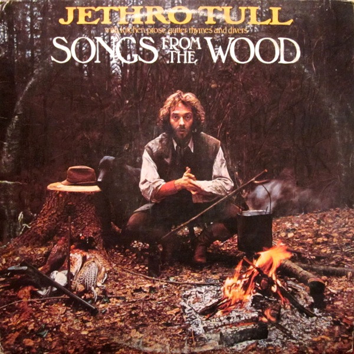

# Songs From The Wood

By Jethro Tull

## Album Data

[Discogs URL](https://www.discogs.com/release/6711538-Jethro-Tull-Songs-From-The-Wood)

- Catalog #: CHR 1132
- Label: Chrysalis
- Format: LP, Album, San
- Rating: 
- Released: 1977
- Release ID: 6711538
- Media condition: Very Good Plus (VG+)
- Sleeve condition: Very Good Plus (VG+)
- Speed: 33 rpm
- Weight: 

## See also

- [Aqualung (The 2011 Steven Wilson Stereo Remix)](Aqualung_The_2011_Steven_Wilson_Stereo_Remix.md)
- [Minstrel In The Gallery (40th Anniversary LP Édition)](Minstrel_In_The_Gallery_40th_Anniversary_LP_Édition.md)
- [Thick As A Brick](Thick_As_A_Brick.md)
