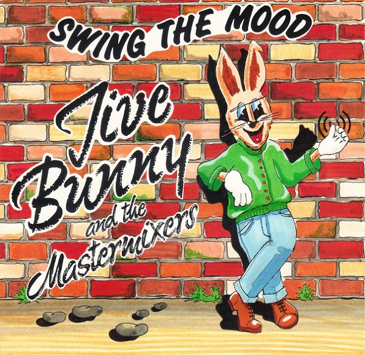

# Swing The Mood

By Jive Bunny And The Mastermixers

## Album Data

[Discogs URL](https://www.discogs.com/release/2635847-Jive-Bunny-And-The-Mastermixers-Swing-The-Mood)

- Catalog #: 7-99140
- Label: ATCO Records, Music Factory
- Formats: Vinyl
- Format: 7", Single
- Rating: 
- Released: 1989
- Year: 1989
- Release ID: 2635847
- Media condition: Very Good Plus (VG+)
- Sleeve condition: 
- Speed: 45 rpm
- Weight: 

## Album Tracks

| **Position** | **Title** | **Duration** |
|--------------|-----------|--------------|
| A | **Swing The Mood (Radio Mix)** | 4:02 |
| B | **Glenn Miller Medley (The J.B. Edit)** | 3:47 |

## Artist Roles

| **Name** | **Role** |
|----------|----------|
| **Les Hemstock** | Concept By [Original Concept] |
| **Mick Hand (2)** | Design [Sleeve] |
| **Andy Pickles** | Engineer |
| **John Pickles** | Executive-Producer |
| **Dennis King** | Mastered By |
| **Andy Pickles** | Producer |
| **Les Hemstock** | Producer |

## See also

- 
