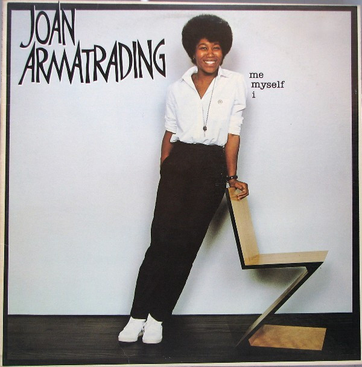

# Me Myself I

By Joan Armatrading

## Album Data

[Discogs URL](https://www.discogs.com/release/1331298-Joan-Armatrading-Me-Myself-I)

- Catalog #: SP-4809, SP 4809
- Label: A&M Records, A&M Records
- Format: LP, Album, San
- Rating: 
- Released: 1980
- Release ID: 1331298
- Media condition: Very Good Plus (VG+)
- Sleeve condition: Very Good (VG)
- Speed: 33 rpm
- Weight: 

## See also

- [Joan Armatrading](Joan_Armatrading.md)
- [Track Record](Track_Record.md)
- [Beets: Sleight of Hand](../../Beets/Joan_Armatrading/Sleight_of_Hand.md)
- [Beets: The Key](../../Beets/Joan_Armatrading/The_Key.md)
- [Beets: The Shouting Stage](../../Beets/Joan_Armatrading/The_Shouting_Stage.md)
- [Beets: To The Limit](../../Beets/Joan_Armatrading/To_The_Limit.md)
