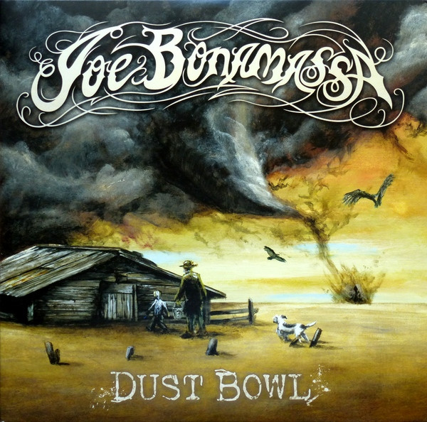

# Dust Bowl

By Joe Bonamassa

## Album Data

[Discogs URL](https://www.discogs.com/release/9299277-Joe-Bonamassa-Dust-Bowl)

- Catalog #: JRA58236
- Label: J&R Adventures
- Formats: Vinyl, Gatefold, 180g
- Format: 2xLP, Album, RE, Gat, Reissue
- Rating: 
- Released: 2016
- Year: 2011
- Release ID: 9299277
- Media condition: Mint (M)
- Sleeve condition: Mint (M)
- Speed: 33 rpm
- Weight: 180 gram

## Album Tracks

| **Position** | **Title** | **Duration** |
|--------------|-----------|--------------|
| A1 | **Slow Train** | 6:50 |
| A2 | **Dust Bowl** | 4:33 |
| A3 | **Tennessee Plates** | 4:19 |
| B1 | **The Meaning Of The Blues** | 5:44 |
| B2 | **Black Lung Heartache** | 4:14 |
| B3 | **You Better Watch Yourself** | 3:31 |
| C1 | **The Last Matador Of Bayonne** | 5:24 |
| C2 | **Heartbreaker** | 5:49 |
| C3 | **No Love On The Street** | 6:32 |
| D1 | **The Whale That Swallowed Jonah** | 4:46 |
| D2 | **Sweet Rowena** | 4:34 |
| D3 | **Prisoner** | 6:49 |

## Artist Roles

| **Name** | **Role** |
|----------|----------|
| **Roy Weisman** | Executive-Producer |
| **Kevin Shirley** | Producer |

## See also

- 
- [Beets: Dust Bowl](../../Beets/Joe_Bonamassa/Dust_Bowl.md)
