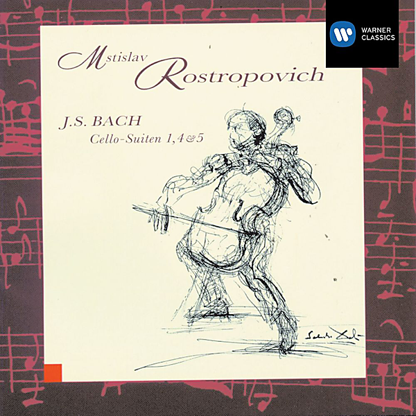

# Bach Cello Suites

By "Johann Sebastian Bach, Isang Enders"

## Album Data

[Discogs URL](https://www.discogs.com/release/7494194-"Johann-Sebastian-Bach,-Isang-Enders"-Bach-Cello-Suites)

- Catalog #: 0300609BC
- Label: Berlin Classics
- Format: 3xLP, Album
- Rating: 
- Released: 2015
- Release ID: 7494194
- Media condition: Mint (M)
- Sleeve condition: Mint (M)
- Speed: 33 rpm
- Weight: 180 gram

## Album Tracks

| **Position** | **Title** | **Duration** |
|--------------|-----------|--------------|
| A | **Suite Nr. 5 C - Moll BWV 1011 / 995** |  |
| B | **Suite Nr. 2 D - Moll BWV 1008** |  |
| C | **Suite Nr. 4 Es - Dur BWV 1010** |  |
| D | **Suite Nr. 3 C - Dur BWV 1009** |  |
| E | **Suite Nr. 1 G - Dur BWV 1007** |  |
| F | **Suite Nr. 6 D - Dur BWV 1012** |  |

## See also

- 
