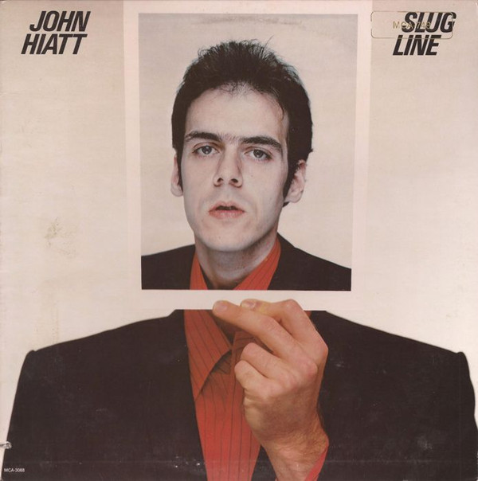

# Slug Line

By John Hiatt

## Album Data

[Discogs URL](https://www.discogs.com/release/7732037-John-Hiatt-Slug-Line)

- Catalog #: MCA-3088
- Label: MCA Records
- Format: LP, Album, Glo
- Rating: 
- Released: 1979
- Release ID: 7732037
- Media condition: Very Good Plus (VG+)
- Sleeve condition: Very Good Plus (VG+)
- Speed: 33 rpm
- Weight: 

## Album Tracks

| **Position** | **Title** | **Duration** |
|--------------|-----------|--------------|
| A1 | **You Used To Kiss The Girls** | 2:31 |
| A2 | **The Negroes Were Dancing** | 2:45 |
| A3 | **Slug Line** | 2:59 |
| A4 | **Madonna Road** | 4:18 |
| A5 | **(No More) Dancin' In The Street** | 2:22 |
| A6 | **Long Night** | 5:18 |
| B1 | **The Night That Kenny Died** | 2:34 |
| B2 | **Radio Girl** | 2:54 |
| B3 | **You're My Love Interest** | 3:14 |
| B4 | **Take Off Your Uniform** | 4:06 |
| B5 | **Sharon's Got A Drugstore** | 2:10 |
| B6 | **Washable Ink** | 3:19 |

## See also

- 
- [Beets: Slug Line](../../Beets/John_Hiatt/Slug_Line.md)
