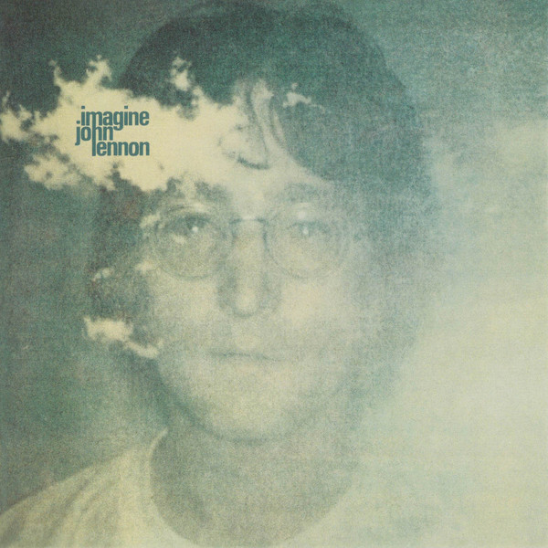

# Imagine

By John Lennon

## Album Data

[Discogs URL](https://www.discogs.com/release/7381085-John-Lennon-Imagine)

- Catalog #: 0600753570951, 5357095
- Label: Apple Records, Apple Records
- Formats: Vinyl, 180 Gram
- Format: LP, Album, RE, RM, 180, Reissue, Remastered
- Rating: 
- Released: 2015
- Year: 1971
- Release ID: 7381085
- Media condition: Mint (M)
- Sleeve condition: Near Mint (NM or M-)
- Speed: 33 rpm
- Weight: 180 gram

## Album Tracks

| **Position** | **Title** | **Duration** |
|--------------|-----------|--------------|
| A1 | **Imagine** | 2:59 |
| A2 | **Crippled Inside** | 3:43 |
| A3 | **Jealous Guy** | 4:10 |
| A4 | **It's So Hard** | 2:22 |
| A5 | **I Don't Want To Be A Soldier** | 6:01 |
| B1 | **Give Me Some Truth** | 3:11 |
| B2 | **Oh My Love** | 2:40 |
| B3 | **How Do You Sleep?** | 5:29 |
| B4 | **How?** | 3:37 |
| B5 | **Oh Yoko!** | 4:18 |

## Artist Roles

| **Name** | **Role** |
|----------|----------|
| **John Lennon** | Arranged By |
| **John Lennon & Yoko Ono** | Arranged By |
| **Yoko Ono** | Artwork [Whip And Mirror] |
| **Yoko Ono** | Cover [Cloud Piece On Cover] |
| **Yoko Ono** | Design [Cover Design], Photography By |
| **Eddie Beer** | Engineer [Ascot Sound Studios] |
| **Eddie Klein** | Engineer [Ascot Sound Studios] |
| **Eddie Veal** | Engineer [Ascot Sound Studios] |
| **Eddy Offord** | Engineer [Ascot Sound Studios] |
| **Phil McDonald** | Engineer [Ascot Sound Studios] |
| **Jack Douglas** | Engineer [Record Plant] |
| **Roy Cicala** | Engineer [Record Plant] |
| **Shelly Yakus** | Engineer [Record Plant] |
| **Allan Steckler** | Engineer [This And That At Record Plant] |
| **Arlene Reckson-Cohen** | Engineer [This And That At Record Plant] |
| **Tom Rabstenek** | Engineer [This And That At Record Plant] |
| **The Flux Fiddlers** | Featuring [With] |
| **Sean Magee** | Lacquer Cut By [Runout Etching i…i] |
| **Dan Richter** | Management [John & Yoko's Personal Assistant] |
| **Torrie Zito** | Orchestrated By [String Orchestrations] |
| **Val & Diana** | Other [Food By] |
| **Mal Evans & Peter Bendry** | Other [This & That] |
| **John Lennon** | Performer |
| **The Plastic Ono Band** | Performer |
| **John Lennon & Yoko Ono** | Producer |
| **Phil Spector** | Producer |
| **John Lennon** | Songwriter |
| **Yoko Ono** | Songwriter [Uncredited] |
| **George Maciunas** | Typography |
| **John Lennon** | Vocals [Uncredited] |

## See also

- [Walls And Bridges](Walls_And_Bridges.md)
- [Beets: Imagine](../../Beets/John_Lennon/Imagine.md)
- [Beets: John Lennon Box Set](../../Beets/John_Lennon/John_Lennon_Box_Set.md)
- [Beets: John Lennon/Plastic Ono Band](../../Beets/John_Lennon/John_Lennon-Plastic_Ono_Band.md)
- [Beets: Mind Games](../../Beets/John_Lennon/Mind_Games.md)
- [Beets: Rock ’n’ Roll](../../Beets/John_Lennon/Rock_’n’_Roll.md)
- [Beets: Some Time In New York City](../../Beets/John_Lennon/Some_Time_In_New_York_City.md)
- [Beets: The John Lennon Collection](../../Beets/John_Lennon/The_John_Lennon_Collection.md)
- [Beets: Walls and Bridges](../../Beets/John_Lennon/Walls_and_Bridges.md)
- [CD: ](../../CD/John_Lennon/John_Lennon.md)
- [CD: Plastic Ono Band](../../CD/John_Lennon/Plastic_Ono_Band.md)
- [CD: The John Lennon Collection](../../CD/John_Lennon/The_John_Lennon_Collection.md)
- [Roon: Double Fantasy](../../Roon/John_Lennon/Double_Fantasy.md)
- [Roon: Double Fantasy Stripped Down (Stripped Down)](../../Roon/John_Lennon/Double_Fantasy_Stripped_Down_Stripped_Down.md)
- [Roon: GIMME SOME TRUTH. (Deluxe)](../../Roon/John_Lennon/GIMME_SOME_TRUTH_Deluxe.md)
- [Roon: HERO.](../../Roon/John_Lennon/HERO.md)
- [Roon: Imagine - The Ultimate Collection (The Ultimate Collection)](../../Roon/John_Lennon/Imagine_-_The_Ultimate_Collection_The_Ultimate_Collection.md)
- [Roon: Mind Games](../../Roon/John_Lennon/Mind_Games.md)
- [Roon: Plastic Ono Band (The Ultimate Collection)](../../Roon/John_Lennon/Plastic_Ono_Band_The_Ultimate_Collection.md)
- [Roon: Walls And Bridges](../../Roon/John_Lennon/Walls_And_Bridges.md)
