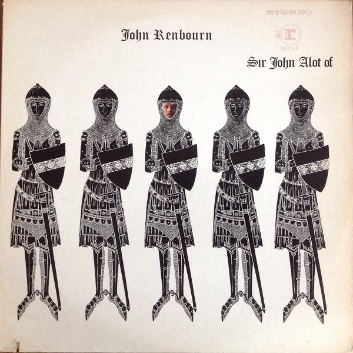

# Sir John Alot Of Merrie Englandes Musyk Thyng & Ye Grene Knyghte

By John Renbourn

## Album Data

[Discogs URL](https://www.discogs.com/release/1244190-John-Renbourn-Sir-John-Alot-Of-Merrie-Englandes-Musyk-Thyng-&-Ye-Grene-Knyghte)

- Catalog #: RS 6344
- Label: Reprise Records
- Format: LP, Album, RE
- Rating: 
- Released: 1975
- Release ID: 1244190
- Media condition: Very Good (VG)
- Sleeve condition: Very Good (VG)
- Speed: 33 rpm
- Weight: 

## Album Tracks

| **Position** | **Title** | **Duration** |
|--------------|-----------|--------------|
| A1 | **The Earle Of Salisbury** | 1:19 |
| A2 | **The Trees They Do Grow High** | 3:26 |
| A3 | **Lady Goes To Church** | 2:50 |
| A4 | **Morgana** | 7:22 |
| B1 | **Transfusion** | 1:58 |
| B2 | **Forty-Eight** | 2:51 |
| B3 | **My Dear Boy** | 1:15 |
| B4 | **White Fishes** | 3:46 |
| B5 | **My Sweet Potato** | 3:17 |
| B6 | **Seven Up** | 3:45 |

## Artist Roles

| **Name** | **Role** |
|----------|----------|
| **John Wood** | Engineer |
| **Terry Cox** | Finger Cymbals, Drums [African], Glockenspiel |
| **Ray Warleigh** | Flute |
| **John Renbourn** | Guitar |
| **Nathan Joseph** | Producer |
| **Osiris Visions** | Sleeve, Design |

## See also

- [The Lady And The Unicorn](The_Lady_And_The_Unicorn.md)
