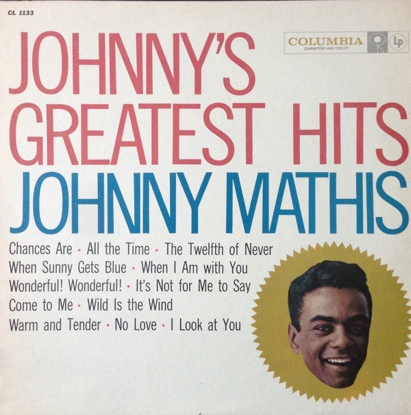

# Johnny's Greatest Hits

By Johnny Mathis

## Album Data

[Discogs URL](https://www.discogs.com/release/4880134-Johnny-Mathis-Johnny's-Greatest-Hits)

- Catalog #: CL 1133
- Label: Columbia
- Format: LP, Comp, Mono, Ter
- Rating: 
- Released: 1958
- Release ID: 4880134
- Media condition: Very Good Plus (VG+)
- Sleeve condition: Very Good (VG)
- Speed: 33 rpm
- Weight: 

## Album Tracks

| **Position** | **Title** | **Duration** |
|--------------|-----------|--------------|
| A1 | **Chances Are** |  |
| A2 | **All The Time** |  |
| A3 | **The Twelfth Of Never** |  |
| A4 | **When Sunny Gets Blue** |  |
| A5 | **When I Am With You** |  |
| A6 | **Wonderful! Wonderful!** |  |
| B1 | **It's Not For Me To Say** |  |
| B2 | **Come To Me** |  |
| B3 | **Wild Is The Wind** |  |
| B4 | **Warm And Tender** |  |
| B5 | **No Love (But Your Love)** |  |
| B6 | **Look At You** |  |

## Artist Roles

| **Name** | **Role** |
|----------|----------|
| **Ray Conniff & His Orchestra** | Featuring [With] |
| **Ray Ellis And His Orchestra** | Featuring [With] |
| **Norman Menard** | Photography By |

## See also

- 
- [Beets: Johnny's Greatest Hits](../../Beets/Johnny_Mathis/Johnnys_Greatest_Hits.md)
- [Roon: Heavenly](../../Roon/Johnny_Mathis/Heavenly.md)
- [Roon: Johnny](../../Roon/Johnny_Mathis/Johnny.md)
- [Roon: More](../../Roon/Johnny_Mathis/More-_Johnnys_Greatest_Hits.md)
- [Roon: Open Fire, Two Guitars](../../Roon/Johnny_Mathis/Open_Fire__Two_Guitars.md)
- [Roon: Rapture](../../Roon/Johnny_Mathis/Rapture.md)
- [Roon: Warm](../../Roon/Johnny_Mathis/Warm.md)
- [Roon: Wonderful, Wonderful](../../Roon/Johnny_Mathis/Wonderful__Wonderful.md)
