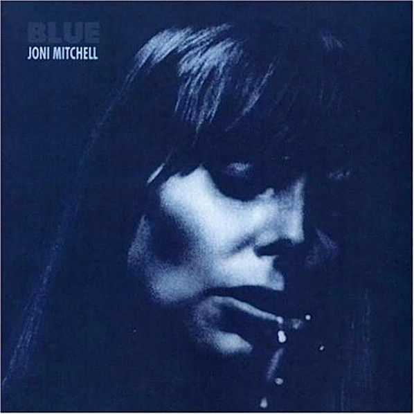

# Blue

By Joni Mitchell

## Album Data

[Discogs URL](https://www.discogs.com/release/2571066-Joni-Mitchell-Blue)

- Catalog #: 74842
- Label: Reprise Records
- Format: LP, Album, RE, RM, 180
- Rating: 
- Released: 2007
- Release ID: 2571066
- Media condition: Mint (M)
- Sleeve condition: Mint (M)
- Speed: 33 rpm
- Weight: 180 gram

## Album Tracks

| **Position** | **Title** | **Duration** |
|--------------|-----------|--------------|
| A1 | **All I Want** | 3:32 |
| A2 | **My Old Man** | 3:33 |
| A3 | **Little Green** | 3:25 |
| A4 | **Carey** | 3:00 |
| A5 | **Blue** | 3:00 |
| B1 | **California** | 3:48 |
| B2 | **This Flight Tonight** | 2:50 |
| B3 | **River** | 4:00 |
| B4 | **A Case Of You** | 4:20 |
| B5 | **The Last Time I Saw Richard** | 4:13 |

## Artist Roles

| **Name** | **Role** |
|----------|----------|
| **Gary Burden** | Art Direction |
| **Stephen Stills** | Bass, Guitar |
| **Russ Kunkel** | Drums |
| **Henry Lewy** | Engineer |
| **James Taylor (2)** | Guitar |
| **Kevin Gray** | Lacquer Cut By |
| **Steve Hoffman** | Lacquer Cut By |
| **Sneaky Pete Kleinow** | Pedal Steel Guitar [Pedal Steel] |
| **Tim Considine** | Photography By [Cover Photography] |
| **Kevin Gray** | Remastered By |
| **Steve Hoffman** | Remastered By |
| **Joni Mitchell** | Written-By |

## See also

- [Court And Spark](Court_And_Spark.md)
- [The Hissing Of Summer Lawns](The_Hissing_Of_Summer_Lawns.md)
- [Beets: Blue](../../Beets/Joni_Mitchell/Blue.md)
- [Beets: Clouds](../../Beets/Joni_Mitchell/Clouds.md)
- [Beets: Court and Spark](../../Beets/Joni_Mitchell/Court_and_Spark.md)
- [Beets: For the Roses](../../Beets/Joni_Mitchell/For_the_Roses.md)
- [Beets: Hejira](../../Beets/Joni_Mitchell/Hejira.md)
- [Beets: Hits](../../Beets/Joni_Mitchell/Hits.md)
- [Beets: Ladies of the Canyon](../../Beets/Joni_Mitchell/Ladies_of_the_Canyon.md)
- [Beets: The Hissing of Summer Lawns](../../Beets/Joni_Mitchell/The_Hissing_of_Summer_Lawns.md)
- [Beets: Turbulent Indigo](../../Beets/Joni_Mitchell/Turbulent_Indigo.md)
- [Roon: Blue](../../Roon/Joni_Mitchell/Blue.md)
- [Roon: Clouds](../../Roon/Joni_Mitchell/Clouds.md)
- [Roon: Court And Spark](../../Roon/Joni_Mitchell/Court_And_Spark.md)
- [Roon: For the Roses](../../Roon/Joni_Mitchell/For_the_Roses.md)
- [Roon: Ladies Of The Canyon](../../Roon/Joni_Mitchell/Ladies_Of_The_Canyon.md)
- [Roon: The Hissing of Summer Lawns](../../Roon/Joni_Mitchell/The_Hissing_of_Summer_Lawns.md)
- [Roon: The Reprise Albums (1968-1971) (2021 Remaster)](../../Roon/Joni_Mitchell/The_Reprise_Albums_1968-1971_2021_Remaster.md)
- [Roon: Turbulent Indigo](../../Roon/Joni_Mitchell/Turbulent_Indigo.md)
