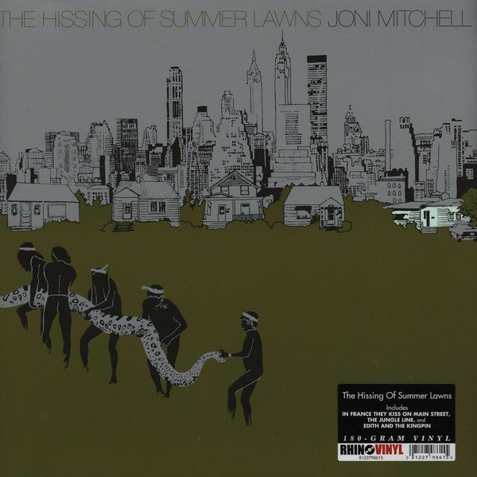

# The Hissing Of Summer Lawns

By Joni Mitchell

## Album Data

[Discogs URL](https://www.discogs.com/release/4422421-Joni-Mitchell-The-Hissing-Of-Summer-Lawns)

- Catalog #: 8122798615
- Label: Rhino Records (2), Asylum Records
- Formats: Vinyl, 180 Gram, Gatefold
- Format: LP, Album, RE, 180
- Rating: 
- Released: 2013
- Year: 1975
- Release ID: 4422421
- Media condition: Mint (M)
- Sleeve condition: Mint (M)
- Speed: 33 rpm
- Weight: 180 gram

## Album Tracks

| **Position** | **Title** | **Duration** |
|--------------|-----------|--------------|
| A1 | **In France They Kiss On Main Street** | 3:17 |
| A2 | **The Jungle Line** | 4:20 |
| A3 | **Edith And The Kingpin** | 3:35 |
| A4 | **Don't Interrupt The Sorrow** | 4:04 |
| A5 | **Shades Of Scarlett Conquering** | 4:57 |
| B1 | **The Hissing Of Summer Lawns** | 3:00 |
| B2 | **The Boho Dance** | 3:56 |
| B3 | **Harry's House / Centerpiece** | 6:52 |
| B4 | **Sweet Bird** | 4:10 |
| B5 | **Shadows And Light** | 4:15 |

## Artist Roles

| **Name** | **Role** |
|----------|----------|
| **Joni Mitchell** | Acoustic Guitar |
| **Max Bennett** | Bass |
| **Wilton Felder** | Bass |
| **John Guerin** | Drums |
| **Larry Carlton** | Electric Guitar |
| **Victor Feldman** | Electric Piano |
| **Ellis Sorkin** | Engineer [Assistant] |
| **Henry Lewy** | Engineer, Mixed By |
| **Bud Shank** | Flute |
| **Chris Bellman** | Lacquer Cut By |
| **Norman Seeff** | Photography By |
| **Joni Mitchell** | Piano |
| **Chuck Findley** | Trumpet |
| **Joni Mitchell** | Vocals, Mixed By, Design, Illustration |
| **Joni Mitchell** | Written-By |

## See also

- [Blue](Blue.md)
- [Court And Spark](Court_And_Spark.md)
- [Beets: Blue](../../Beets/Joni_Mitchell/Blue.md)
- [Beets: Clouds](../../Beets/Joni_Mitchell/Clouds.md)
- [Beets: Court and Spark](../../Beets/Joni_Mitchell/Court_and_Spark.md)
- [Beets: For the Roses](../../Beets/Joni_Mitchell/For_the_Roses.md)
- [Beets: Hejira](../../Beets/Joni_Mitchell/Hejira.md)
- [Beets: Hits](../../Beets/Joni_Mitchell/Hits.md)
- [Beets: Ladies of the Canyon](../../Beets/Joni_Mitchell/Ladies_of_the_Canyon.md)
- [Beets: The Hissing of Summer Lawns](../../Beets/Joni_Mitchell/The_Hissing_of_Summer_Lawns.md)
- [Beets: Turbulent Indigo](../../Beets/Joni_Mitchell/Turbulent_Indigo.md)
- [Roon: Blue](../../Roon/Joni_Mitchell/Blue.md)
- [Roon: Clouds](../../Roon/Joni_Mitchell/Clouds.md)
- [Roon: Court And Spark](../../Roon/Joni_Mitchell/Court_And_Spark.md)
- [Roon: For the Roses](../../Roon/Joni_Mitchell/For_the_Roses.md)
- [Roon: Ladies Of The Canyon](../../Roon/Joni_Mitchell/Ladies_Of_The_Canyon.md)
- [Roon: The Hissing of Summer Lawns](../../Roon/Joni_Mitchell/The_Hissing_of_Summer_Lawns.md)
- [Roon: The Reprise Albums (1968-1971) (2021 Remaster)](../../Roon/Joni_Mitchell/The_Reprise_Albums_1968-1971_2021_Remaster.md)
- [Roon: Turbulent Indigo](../../Roon/Joni_Mitchell/Turbulent_Indigo.md)
