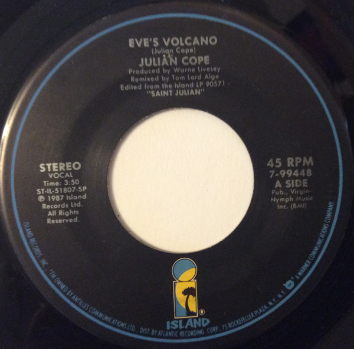

# Eve's Volcano

By Julian Cope

## Album Data

[Discogs URL](https://www.discogs.com/release/9770177-Julian-Cope-Eve's-Volcano)

- Catalog #: 7-99448
- Label: Island Records
- Formats: Vinyl
- Format: 7", Single
- Rating: 
- Released: 1987
- Year: 1987
- Release ID: 9770177
- Media condition: Very Good Plus (VG+)
- Sleeve condition: Very Good Plus (VG+)
- Speed: 45 rpm
- Weight: 

## Album Tracks

| **Position** | **Title** | **Duration** |
|--------------|-----------|--------------|
| A | **Eve's Volcano** | 3:50 |
| B | **Almost Beautiful Child** | 5:20 |

## Artist Roles

| **Name** | **Role** |
|----------|----------|
| **Double De Harrison** | Producer |
| **Warne Livesey** | Producer |
| **Tom Lord-Alge** | Remix |

## See also

- 
